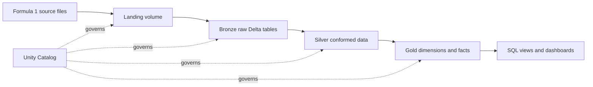

<h1 align="center">Formula 1 Databricks Lakehouse</h1>

<p align="center">
  <a href="https://cagricatik.github.io/formula1-databricks-lakehouse/">
    
  </a>
  <a href="https://azure.microsoft.com/products/databricks">
    
  </a>
  <a href="https://delta.io/">
    
  </a>
</p>

A hands-on Formula 1 data engineering project for Azure Databricks. The
repository documents and demonstrates a Lakehouse build that moves racing data
from raw landing files through Bronze, Silver, and Gold layers, then serves
analytics-ready standings and dashboard use cases.

The project is intentionally learning-oriented: it combines guided
documentation, source-format notebook examples, sample landing data, and ERD
notes that explain the model before and after transformation.

## What You Will Build

- A medallion Lakehouse using Landing, Bronze, Silver, and Gold layers.
- Bronze ingestion for CSV and JSON Formula 1 source files.
- Silver transformations with cleaned, standardized, quality-checked data.
- Gold dimensional outputs for driver, constructor, race, and result analytics.
- Databricks SQL views and dashboard-oriented analytical questions.
- Incremental-processing concepts using batch folders and operational checks.
- Unity Catalog organization for schemas, volumes, and governed table names.

## Architecture



## Documentation

The main learning path starts at [docs/index.md](docs/index.md). It covers:

| Section | Focus |
| --- | --- |
| Introduction | Project goals and course structure |
| Azure and Databricks setup | Workspace, compute, and Unity Catalog |
| Formula 1 project overview | Source data, requirements, and architecture |
| Bronze ingestion | Reading source files into raw Delta tables |
| Silver transformation | Cleaning, standardizing, and validating data |
| Gold modeling | Dimensions, facts, joins, and analytics outputs |
| Data analytics | SQL views, dashboards, dominance analysis, and AI/BI Genie |
| Incremental processing | Batch contracts, operations, and recovery patterns |
| Deployment | GitHub Pages and Databricks bundle concepts |

The ERD sequence in [erd/README.md](erd/README.md) gives a compact modeling
walkthrough from the raw source model to Lakehouse and Gold-layer design.

## Source Data

Sample data is included under [landing](landing):

```text
landing/
|-- formula1-full-load-landing/
|   |-- circuits.csv
|   |-- constructors.json
|   |-- drivers.json
|   |-- races.csv
|   |-- results/
|   `-- sprints/
`-- formula1-incremental-load-landing/
    |-- 2025-01/
    |-- 2025-02/
    `-- ...
```

The full-load folder represents a complete landing snapshot. The incremental
folder uses sortable batch directories so each batch can be processed in order.

## Run the Documentation Locally

Create a virtual environment, install the docs dependencies, and serve the site:

```bash
python -m venv .venv

# Windows
.venv\Scripts\activate

# macOS/Linux
source .venv/bin/activate

python -m pip install --upgrade pip
python -m pip install -r requirements.txt
zensical serve
```

Build the static site:

```bash
zensical build --clean
```

The GitHub Actions workflow in [.github/workflows/deploy.yml](.github/workflows/deploy.yml)
builds the same site and publishes it to GitHub Pages.

## Working in Databricks

The notebooks are written as source files so they can be reviewed in Git and
adapted into Databricks notebooks. A typical workspace run follows this order:

1. Create or select a Unity Catalog catalog.
2. Create `landing`, `bronze`, `silver`, and `gold` schemas.
3. Upload the sample landing data to a Unity Catalog volume or external
   location.
4. Run the Bronze notebooks to ingest raw data.
5. Run the Silver notebooks to standardize and validate the data.
6. Run the Gold notebooks to build dimensions, facts, and analytics views.

Use [requirements-db.txt](requirements-db.txt) as the reference dependency list
for Databricks-oriented examples.

## Attribution

This repository is based on a [Formula 1 Azure Databricks](https://www.udemy.com/course/azure-databricks-spark-core-for-data-engineers) learning project and
course material.
