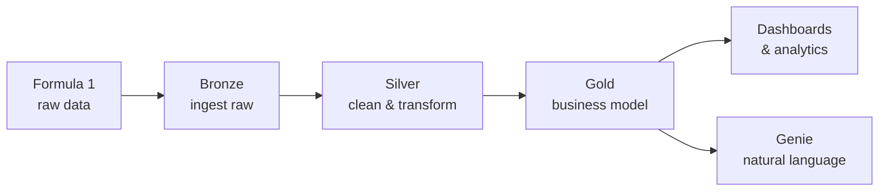

# Course Introduction

Welcome to the **Azure Databricks for Data Engineers** course. This course takes a
hands-on, project-driven approach to building modern data engineering solutions on
the Databricks platform, using **Apache Spark**, **Delta Lake**, **Unity Catalog**,
**Lakeflow Jobs**, and **Databricks Dashboards**.

!!! info "Course freshness"
    The course was fully refreshed in **April 2026**, so all lessons reflect the
    Databricks features and user interface available at that time. Databricks changes
    quickly, so use the linked official documentation when a UI label or platform
    option differs from the screenshots or instructions.

## What you will build

The course is centred on a single, end-to-end project: a cloud-based **Data
Lakehouse** that analyses and reports on data from **Formula 1 motorsport**. You
will use this project to apply every concept as you learn it.

The project is built on the **Medallion Architecture** - a widely used design
pattern in modern data engineering that organises data into progressively refined
layers (Bronze → Silver → Gold).

## Core technologies

| Technology | Role in the course |
| --- | --- |
| **Apache Spark** | The distributed compute engine at the core of Databricks. Used via **PySpark** and **Spark SQL**. |
| **Delta Lake** | Reliable storage layer with ACID transactions for managing data. |
| **Unity Catalog** | Governance layer to organise data, define storage and structure, and control access. |
| **Lakeflow Jobs** | Orchestration of pipelines: scheduling, task dependencies, and reliable runs. |
| **Databricks Dashboards** | Visualisation of insights such as driver and constructor standings. |
| **Genie** | Interaction with data using natural language. |

By the end of the project you will analyse Formula 1 data to identify the most
dominant drivers and teams in the sport's history, and gain the confidence to apply
these skills to real-world projects.

## Who this course is for

This course is designed for learners who want to **learn by doing**. Roughly
three-quarters of the lectures are lab-based, working directly on the project.

!!! warning "Is this the right course for you?"
    - It is **not** a purely theory-based course. If you only want to watch videos
      without practising, this may not be the best fit.
    - The primary objective is teaching **Databricks and core Spark concepts**. It
      does **not** cover Spark Declarative Pipelines or Spark Structured Streaming.

### Assumed knowledge

- **No prior Databricks knowledge is required** - the course starts from the basics
  and builds up gradually.
- **Some basic SQL and Python** is assumed.
- The course is taught on **Microsoft Azure**, so you will need an Azure
  subscription. Don't worry if you don't have one - the next section walks you
  through creating a free account.

## What's next

In the next lesson we look at how the course is structured and the recommended
approach for studying it. Continue to [Course Structure](02_structure.md).

## References

- [Azure Databricks documentation](https://learn.microsoft.com/en-us/azure/databricks/)
- [Apache Spark overview](https://spark.apache.org/)
- [Delta Lake documentation](https://docs.delta.io/)
- [What is the medallion lakehouse architecture?](https://learn.microsoft.com/en-us/azure/databricks/lakehouse/medallion)
