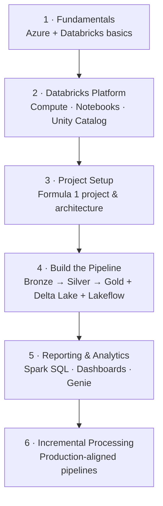

# Course Structure & Learning Path

This course is best understood as a **journey** made up of a few key stages. Each
stage builds on the previous one, so the recommended approach is to follow the
sections in order and complete every exercise as you go.

## The stages

### 1. Fundamentals

Set up the Azure environment and gain a basic understanding of Azure Databricks so
you are comfortable getting started.

!!! tip "Already familiar with Azure and Databricks?"
    You can move through these early sections quickly.

### 2. The Databricks platform

Look at how Databricks works in practice. Three components are central and are used
throughout the project:

| Component | Purpose |
| --- | --- |
| **Compute** | Where your code runs and data is processed. |
| **Notebooks** | Where you write and organise your code. |
| **Unity Catalog** | Where you organise and manage data - defining where it is stored, how it is structured, and who can access it. |

### 3. Project setup

Introduce the **Formula 1 project**, walk through the solution architecture, and set
up the environment where the project will be built.

### 4. Building the pipeline

The core of the course. Build the data pipeline step by step using the **Medallion
Architecture**:

- **Bronze** - ingest raw data.
- **Silver** - clean and transform it.
- **Gold** - build a business-friendly model.

Along the way you will be introduced to **Delta Lake** for reliable storage and
will start building **Lakeflow Jobs** to orchestrate the pipeline.

### 5. Reporting & analytics

Use **Spark SQL** to query data and **Databricks Dashboards** to analyse it and
generate insights. **Genie** is also introduced for analysing data using natural
language.

### 6. Incremental data processing

Enhance the pipeline to align it with real-world production systems, and extend the
Lakeflow Jobs to support this incremental design.

## How to study this course

!!! note "Recommended approach"
    1. Follow the sections **in order** - each stage builds on the previous one.
    2. **Complete all exercises** as you go along.
    3. Avoid skipping ahead - doing so may make later parts harder to follow.

## What's next

With the structure in mind, the next section helps you set up an Azure subscription.
Continue to [Creating a Free Azure Account](../02_subscription/01_azure-account.md).

## References

- [Azure Databricks documentation](https://learn.microsoft.com/en-us/azure/databricks/)
- [Apache Spark overview](https://spark.apache.org/)
- [Delta Lake documentation](https://docs.delta.io/)
- [What is the medallion lakehouse architecture?](https://learn.microsoft.com/en-us/azure/databricks/lakehouse/medallion)
