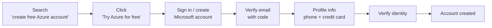

# Creating a Free Azure Account

This course is taught on Microsoft Azure, so you need an Azure subscription. This
lesson walks through creating a **free account**, the credits you receive, and the
resources available to you.

## What you get with a free account

The free account is only available to **new** Azure customers. If you already have
an Azure account, you cannot get another free account - instead you can create a
**pay-as-you-go** account.

| Benefit | Details |
| --- | --- |
| **Selected popular services free** | Limited free quantities are available for the first **12 months**. |
| **Always-free services** | Some services have free monthly quantities beyond the first 12 months. |
| **$200 free credit** | Valid only for the **first 30 days**, then expires. |
| **Credit card required** | Your card is **not charged** until you manually upgrade (e.g. to pay-as-you-go). |
| **Cancel anytime** | You can cancel the free subscription at any point. |

## Steps to create the account

1. Search online for **"create free Azure account"** and open the link *"Create your
   Azure free account today"*.
2. Review what the free account includes, then click **Try Azure for free** /
   **Sign up**.
3. Sign in with a **Microsoft account**, or click **Create one**. You can even
   create a new email address via *"Get a new email address"* if needed.
4. Choose a password, then enter the **verification code** sent to your email.
5. Complete the **profile information**. Two items are important:
   - A valid **phone number** - Microsoft will text or call to verify it belongs to
     you.
   - **Credit card information** - required, but not charged until you upgrade.
6. Verify your identity with the emailed code and click **Verify**.

With that, the Azure free account is created.

## What's next

Once your account is set up, the next lesson gives an overview of the Azure portal.
Continue to [Azure Portal Tour](02_azure-portal.md).

## References

- [Avoid charges with your Azure free account](https://learn.microsoft.com/en-us/azure/cost-management-billing/manage/avoid-charges-free-account)
- [What is the Azure portal?](https://learn.microsoft.com/en-us/azure/azure-portal/azure-portal-overview)
