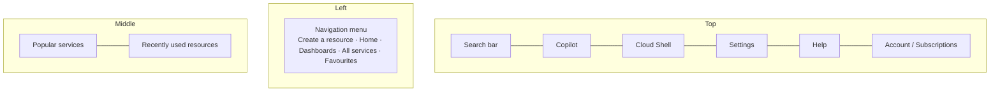

# Azure Portal Tour

The **Azure portal** is the main web interface you will use throughout the course to
access and manage Azure resources. This lesson gives a quick tour of its key
sections.

!!! note "The portal evolves"
    Microsoft regularly updates the portal to improve the user experience, so some
    elements may look slightly different from what is described here.

## Signing in

1. Open your browser and go to **[portal.azure.com](https://portal.azure.com)**.
2. Sign in with the Azure account you created in the previous lesson.
3. You land on the **Azure Portal homepage**.

## Key areas of the portal

### Navigation menu (top-left)

From here you can **Create a resource**, return to the **Home** page, access
**Dashboards**, or view **All services**. Any services you mark as **favourites**
appear here for quick access.

### Middle section

- **Popular services** - shortcuts based on your preferences.
- **Recently used resources** - populated as you start working through the course
  (empty at first).

### Search bar

One of the most useful features. It lets you search for **anything** within the
portal - an invaluable tool for quickly finding resources as your projects grow.

### Toolbar icons (top-right area)

| Icon | What it does |
| --- | --- |
| **Copilot** | Opens a chat window to ask questions; it searches the documentation and answers them. |
| **Cloud Shell** | Use **Bash** or **PowerShell** to interact with Azure directly. *(Not used in this course, but available for command-line scripting.)* |
| **Settings** | Customise the portal - switch between Home/Dashboard default view, change the menu style from **Fly out** to **Dock**, adjust the colour scheme (e.g. high-contrast mode). |
| **Help** | Search support articles and send feedback to Microsoft. |
| **Account** | Switch between Azure subscriptions or sign out (top-right). |

## Summary

The Azure portal is a powerful, flexible interface that lets you access and manage
all your Azure resources in one place. As the course progresses you will become
more familiar with these sections and find the portal easy to navigate.

## What's next

With Azure set up, the next section introduces Azure Databricks itself. Continue to
[Introduction to Databricks](../03_databricks/01_intro.md).

## References

- [Avoid charges with your Azure free account](https://learn.microsoft.com/en-us/azure/cost-management-billing/manage/avoid-charges-free-account)
- [What is the Azure portal?](https://learn.microsoft.com/en-us/azure/azure-portal/azure-portal-overview)
