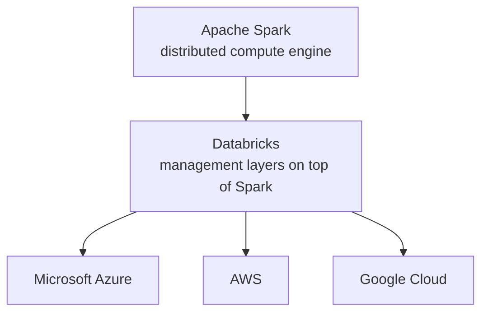
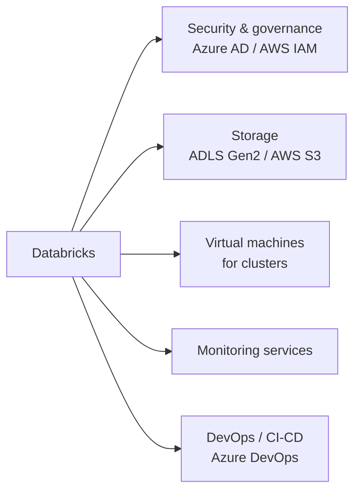

# Introduction to Databricks

Databricks is a **Spark-based unified data analytics platform** that helps us build
**data lakehouses**. This lesson gives a high-level overview; the key components are
explored in detail in the following lessons.

## What is Databricks?

At the core of Databricks is the open-source distributed compute engine **Apache
Spark**, widely used across the industry for big data and machine learning projects.
Databricks was founded by the **creators of Apache Spark** to make working with
Spark easier by providing the essential management layers, and it is available on
all major cloud platforms - **Microsoft Azure, AWS, and Google Cloud**.

## Apache Spark

Apache Spark is a **fast, unified analytical engine** designed for big data
processing and machine learning.

- Originally developed at **UC Berkeley in 2009** and open-sourced in **2010**.
- Became an **Apache Software Foundation** project in **2013** and has seen
  significant adoption since.
- Used by companies such as **Yahoo, eBay, and Netflix** for large-scale data
  processing - handling petabytes of data on clusters with thousands of nodes.

### Why Spark over Hadoop?

Spark was designed to address the limitations of **Hadoop**, the dominant big data
engine at the time, which was slow and inefficient for interactive and iterative
computing.

!!! tip "Spark's advantages"
    - Simpler, faster APIs that are easier to work with.
    - Up to **100× faster** than Hadoop for large-scale processing, via **in-memory
      computing** and various optimizations.
    - Runs on a **distributed** computing platform.
    - A **unified engine** supporting both **batch and streaming** workloads.
    - Built-in libraries for **SQL, machine learning, and graph processing**.

## How Databricks makes Spark easier

While Spark is powerful, setting up clusters, managing security, and using
third-party tools to write programs can be challenging. Databricks solves this:

| Capability | What it provides |
| --- | --- |
| **Clusters in a few clicks** | Choose runtimes for general-purpose, memory-optimized, or GPU (ML) workloads. |
| **Notebook IDE** | Integrated Jupyter-style notebooks to create and run apps, collaborate, and connect to Git. |
| **Administrative controls** | Manage user access to workspaces and clusters for secure usage. |
| **Databricks Runtime** | Optimized Spark runtime that packages Apache Spark with Databricks-managed performance, security, and reliability features. |
| **Photon** | A vectorized query engine for accelerating eligible SQL and DataFrame workloads. |
| **Unity Catalog** | Govern catalogs, schemas, tables, views, volumes, functions, access control, and lineage. The Hive metastore is a legacy option that you might still see in older workspaces. |
| **Delta Lake** | Robust **ACID transactions** for data reliability and integrity. |
| **Lakeflow Spark Declarative Pipelines** | A declarative pipeline framework for building managed data transformations. Formerly known as Delta Live Tables. |
| **Lakeflow Jobs** | Built-in scheduling and orchestration of tasks and pipelines. Formerly known as Databricks Workflows. |
| **Databricks SQL** | A SQL-based analytical environment for exploring data, dashboards, and scheduled refreshes. |
| **Managed MLflow** | Manage the ML lifecycle: experimentation, deployment, model registry, etc. |
| **DatabricksIQ** | An AI assistant to help develop and debug code, add comments, and create dashboards. |

## Databricks and the cloud providers

Databricks is available on **Azure, AWS, and Google Cloud**. The integration is
quite similar across platforms, with one important distinction on Azure:

!!! info "Azure first-party service"
    On Azure, Databricks is hosted as a **first-party service**. This means you get
    **unified billing** and **direct support from Microsoft** for all your services
    - both the Azure services and Databricks.

Across all platforms, Databricks leverages the cloud providers' services:

- **Security & governance** - Azure Active Directory, AWS IAM, etc.
- **Storage** - Azure Data Lake Storage Gen2, AWS S3, etc.
- **Compute** - the underlying VMs for clusters are provided by the cloud provider.
- **Monitoring** - use the cloud provider's monitoring to track and analyse
  workloads.
- **DevOps** - integrate with services such as Azure DevOps for CI/CD.

## Summary

Databricks is a **Spark-based unified data analytics platform** optimized for each
of the major cloud providers. The following lessons explore each of its components
in action.

## What's next

Next we create a Databricks workspace in Azure. Continue to
[Creating an Azure Databricks Workspace](02_creating-azure-databricks-overview.md).

## References

- [Azure Databricks documentation](https://learn.microsoft.com/en-us/azure/databricks/)
- [High-level architecture: Azure Databricks](https://learn.microsoft.com/en-us/azure/databricks/getting-started/overview)
- [Databricks concepts](https://learn.microsoft.com/en-us/azure/databricks/getting-started/concepts)
- [Apache Spark overview](https://spark.apache.org/)
