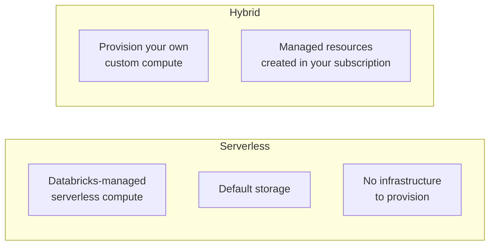
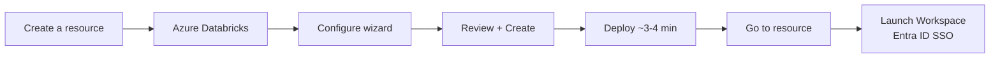

# Creating an Azure Databricks Workspace

In this lesson we create a **Databricks service** within Azure using the setup
wizard in the Azure portal.

## Starting the wizard

1. Open your browser and navigate to **[portal.azure.com](https://portal.azure.com)**,
   then sign in.
2. From the top-left menu, click **Create a resource** and search for
   **Azure Databricks**.
3. Select **Azure Databricks** and click **Create** to open the setup wizard.

## Basics tab

The wizard guides you through creating a Databricks **workspace**. Configure the
following:

| Setting | Value used in the course | Notes |
| --- | --- | --- |
| **Subscription** | *Azure subscription 1* | Select the subscription appropriate for you. |
| **Resource group** | `databricks-course-rg` | Created new. `rg` denotes a resource group - use a clear naming convention. |
| **Workspace name** | `databricks-course-ws` | `ws` denotes workspace. |
| **Region** | `UK South` | Choose the region closest to you to reduce latency and cost. If unsure, use UK South. |
| **Pricing tier** | **Premium** | Required for this course (see below). |
| **Workspace type** | **Hybrid** | Lets us provision our own custom compute (see below). |
| **Managed resource group** | `databricks-course-managed-rg` | Where Databricks creates managed resources. |

### Pricing tier: Standard vs Premium

Databricks offers two pricing tiers:

| Tier | Includes |
| --- | --- |
| **Standard** | Core workspace features for basic workloads. |
| **Premium** | Adds enterprise governance and access-control capabilities that are commonly required for production data engineering. Confirm the current feature matrix before provisioning, because Databricks packaging changes over time. |

!!! warning "Premium is required"
    The course uses governance and access-control features associated with the
    **Premium** tier. If this is your first time using Databricks, check the current
    Azure Databricks trial and pricing information before provisioning.

### Workspace type: Hybrid vs Serverless

- **Serverless** - quick and easy to spin up; comes with Databricks-managed
  serverless compute and default storage, so you can start building pipelines
  without provisioning any infrastructure.
- **Hybrid** - lets you provision **custom compute**. When provisioning custom
  compute, Databricks creates managed resources (a default storage account, a
  virtual network for the VMs, etc.) in **your subscription**.

!!! note "Why Hybrid?"
    The course chooses **Hybrid** so you learn how to provision your own
    infrastructure. Provide a name for the managed resource group (e.g.
    `databricks-course-managed-rg`) so it is easy to identify - if left blank,
    Databricks generates its own name.

## Networking tab

Here you can configure advanced networking such as secure connectivity and
deploying the workspace in a private network.

!!! warning "Keep costs down"
    Because this workspace is for learning, set **both** of the following to **No**:

    - Deploy the workspace off the public internet → **No**
    - Provide your own virtual network → **No** (let Azure create it automatically)

    Taking the workspace off the public internet and using your own private network
    **cost extra money**.

## Remaining tabs

- **Encryption** - Azure encrypts data by default; leave the additional encryption
  options as-is.
- **Security & compliance** - leave as default.
- **Tags** - optional key/value pairs to track costs/billing; left empty here.

## Review + Create

1. Click **Review + Create**. Azure validates the configuration.
2. Once validation succeeds, click **Create**.
3. Deployment takes roughly **3–4 minutes**.
4. When complete, click **Go to resource** to open the Azure Databricks service.

## Launching the workspace

From the Databricks service, click **Launch Workspace**. This logs you in using
**Azure Active Directory / Microsoft Entra ID single sign-on**.

### Finding your resources later

The deployment creates the `databricks-course-rg` resource group containing the
Databricks service. To find a resource again you can:

- Use the **search bar** at the top of the portal, or
- Open **All resources** from the top-left menu and filter from there.

## What's next

You have successfully created and launched an Azure Databricks workspace. Next we
tour the workspace UI. Continue to [The Databricks Workspace UI](03_databricks-user-interface.md).

## References

- [Azure Databricks documentation](https://learn.microsoft.com/en-us/azure/databricks/)
- [High-level architecture: Azure Databricks](https://learn.microsoft.com/en-us/azure/databricks/getting-started/overview)
- [Databricks concepts](https://learn.microsoft.com/en-us/azure/databricks/getting-started/concepts)
- [Apache Spark overview](https://spark.apache.org/)
