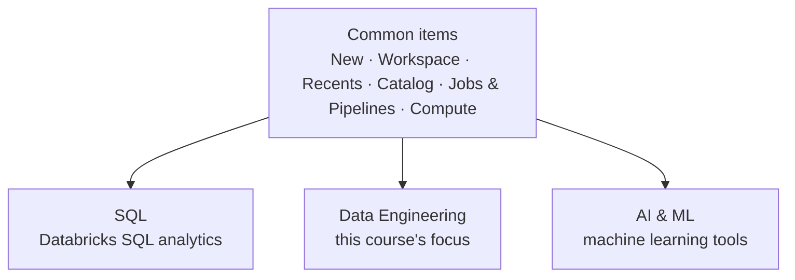

# The Databricks Workspace UI

This lesson gives a high-level overview of the Databricks user interface. Each
section is explored in much more detail in later lessons.

!!! note "The UI evolves quickly"
    This overview reflects the interface as of **January 2026**. The Databricks UI
    changes frequently, so you may notice some minor differences over time.

## How the menu is organised

The main **navigation menu** is on the left of the screen. Databricks provides
multiple products for **data warehousing**, **data engineering**, and **machine
learning**, and the menu is organised around these product areas. Items at the top
are common across all areas.

!!! tip "Simplify the menu"
    Since this course focuses on data engineering, you can **collapse the SQL and
    AI & ML sections** to make the menu much simpler. Sections can be expanded and
    collapsed as needed.

## Key menu items for data engineering

| Menu item | What it does |
| --- | --- |
| **New** | Quick shortcuts to create objects such as notebooks, jobs, and ETL pipelines. *(The course mostly uses the full menus instead, to build familiarity.)* |
| **Workspace** | A container for folders, notebooks, libraries, and files. Each user has their own folder, plus a shared workspace for collaboration. |
| **Recents** | Assets you have recently accessed. |
| **Catalog** | View and interact with tables, views, volumes, and files that exist in Databricks, and create new ones. |
| **Jobs & Pipelines** | Create data ingestion and ETL pipelines, and **Lakeflow Jobs** to schedule notebooks and pipelines to run automatically. Monitor executions under the **Job runs** tab. |
| **Compute** | Create and manage compute: all-purpose compute, jobs compute, SQL warehouses, **cluster pools** (to reduce startup time), and **compute policies** (to control how clusters are created). |

### The Workspace menu in detail

Right-clicking a workspace folder lets you **create or import** assets such as
notebooks, folders, and MLflow experiments. You can also **download notebooks** in:

- Source file formats - **Python, Scala, SQL**, etc., or
- **DBC** format - a Databricks proprietary file format.

### The Data Engineering section

Some items here overlap with what you have already seen - for example, **Job Runs**
takes you to the same page as **Jobs & Pipelines**. The main unique option is
**Data Ingestion**, which lets you:

- Create tables from local files,
- Upload data into Databricks, and
- Integrate with third-party ingestion tools such as **Fivetran**.

!!! info "Out of scope"
    Fivetran is outside the scope of this course.

## The top bar

| Element | Purpose |
| --- | --- |
| **Search bar** | Search across the entire workspace; filter by asset type, owner, location, etc. |
| **Workspace dropdown** | Switch between different workspaces in your subscription without returning to the Azure portal. |
| **AI assistant icon** | Access the built-in Databricks AI assistant. |
| **Top-right menu** | Manage user preferences and perform workspace administration tasks. |

## Summary

If the interface feels like a lot right now, that's completely normal. Each section
is covered in depth in future lessons with plenty of hands-on practice, and by the
end of the course you will be confident navigating the workspace.

## What's next

Next we look at how Databricks works behind the scenes. Continue to
[Databricks Architecture](04_databricks-architecture-overview.md).

## References

- [Azure Databricks documentation](https://learn.microsoft.com/en-us/azure/databricks/)
- [High-level architecture: Azure Databricks](https://learn.microsoft.com/en-us/azure/databricks/getting-started/overview)
- [Databricks concepts](https://learn.microsoft.com/en-us/azure/databricks/getting-started/concepts)
- [Apache Spark overview](https://spark.apache.org/)
