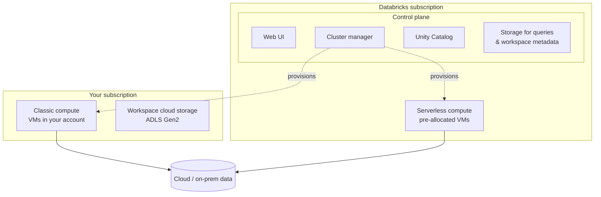
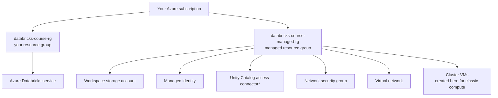

# Databricks Architecture

Understanding the high-level architecture of Databricks helps you know **where your
data is stored** and **where your compute resources are located**. As a developer
you don't need every detail, but this mental model is valuable.

## Control plane and compute plane

The Databricks architecture is divided into two main parts: the **control plane**
and the **compute plane**.

### Control plane

The **control plane** handles all the backend services required by the platform,
and lives in the **Databricks subscription**:

| Component | Role |
| --- | --- |
| **Web UI** | The browser-based interface where users interact with Databricks. |
| **Cluster manager** | Manages and provisions compute when users create or scale clusters. |
| **Unity Catalog** | Data governance - manages access and permissions for your data. |
| **Storage for queries & workspace data** | Stores workspace metadata such as notebooks and job-run details. |

### Compute plane

The **compute plane** is where your data processing takes place. Databricks supports
two types of compute:

| Type | Where it runs | Key characteristic |
| --- | --- | --- |
| **Classic compute** | **Your** cloud subscription | Clusters (VMs) are deployed and managed within your cloud account. |
| **Serverless compute** | **Databricks** subscription | Introduced in 2024. Resources come from a pre-allocated pool of VMs, significantly **reducing cluster startup time**. |

## Workspace cloud storage

When you create a Databricks workspace, a **default workspace cloud storage** is set
up in **your** cloud subscription:

| Cloud | Storage service |
| --- | --- |
| **Azure** | Azure Data Lake Storage Gen2 |
| **AWS** | S3 bucket |
| **GCP** | Google Cloud Storage |

This storage holds **system data** - notebook revisions, job-run details, Spark
logs, and more - and can also hold temporary working data.

!!! warning "Storage is tied to the workspace"
    The workspace storage is tied to the workspace and will be **deleted when the
    workspace itself is deleted**.

## Where the resources live - summary

| Lives in the **Databricks subscription** | Lives in **your subscription** |
| --- | --- |
| Control plane (UI, cluster manager, Unity Catalog, metadata storage) | Classic compute plane |
| Serverless compute (pre-allocated VMs) | Workspace cloud storage |

Through either compute type - classic or serverless - you can access and process
data stored in the cloud or in on-premises applications.

## Under the hood: the resource groups

When you created the Databricks service, Azure created **two resource groups**:

- **`databricks-course-rg`** - the resource group you created, containing the
  **Azure Databricks service**.
- **`databricks-course-managed-rg`** - the **managed resource group** Databricks
  creates to support the service. It contains:
    - The **workspace storage account** (the cloud storage from the architecture
      diagram).
    - An **Azure managed identity**.
    - A **Unity Catalog access connector** *(only if the workspace is Unity
      Catalog–enabled - see note below)*.
    - A **network security group** and a **virtual network**.

!!! info "Unity Catalog enablement"
    Any subscription created in the **last two years** automatically has its
    Databricks workspaces enabled with Unity Catalog. Older subscriptions were not,
    so don't worry if you don't see the access connector - this is covered later.

!!! warning "Don't confuse the managed RG with the control plane"
    Everything in the managed resource group still lives in **your subscription** -
    Databricks merely **manages** those resources. It is **not** the Databricks
    subscription / control plane.

### Key point

The managed resource group is where your **workspace storage account** lives, and
where all the **virtual machines** for **classic compute** clusters are created -
all within **your** subscription. By contrast, **serverless compute** VMs and
resources are created within the **Databricks** subscription. That is the only
difference.

## What's next

You now understand the Databricks architecture and where resources live. This
concludes the Databricks overview section.

## References

- [Azure Databricks documentation](https://learn.microsoft.com/en-us/azure/databricks/)
- [High-level architecture: Azure Databricks](https://learn.microsoft.com/en-us/azure/databricks/getting-started/overview)
- [Databricks concepts](https://learn.microsoft.com/en-us/azure/databricks/getting-started/concepts)
- [Apache Spark overview](https://spark.apache.org/)
