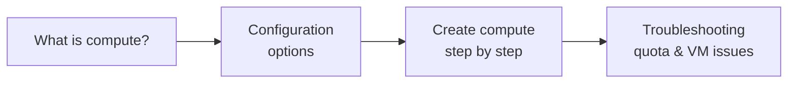

# Databricks Compute - Section Overview

Welcome to a new section of the course focused on **Databricks Compute**. Compute is
the **engine that actually runs your code** in Databricks. Whether you are running
notebooks, jobs, or pipelines, everything depends on how your compute is set up.

## What this section covers

| Lesson | Focus |
| --- | --- |
| **[Compute Types](02_databricks-compute.md)** | A deeper look at what compute is and how it works - Serverless vs Classic. |
| **[Compute Configuration](03_compute-configuration.md)** | The configuration options available, so you can choose the right setup for your workload. |
| **[Creating a Cluster](04_creating-databricks-cluster.md)** | Creating a Databricks compute step by step in the workspace. |
| **[Troubleshooting](05_troubleshooting.md)** | Common issues such as Azure quota limits and VM availability, and how to resolve them. |

By the end of this section you will be comfortable **setting up and managing
Databricks compute** for your projects. Let's get started.

## References

- [Classic compute overview](https://learn.microsoft.com/en-us/azure/databricks/compute/)
- [Compute configuration reference](https://learn.microsoft.com/en-us/azure/databricks/compute/configure)
- [Connect to serverless compute](https://learn.microsoft.com/en-us/azure/databricks/compute/serverless/)
- [Configure compute for jobs](https://learn.microsoft.com/en-us/azure/databricks/jobs/compute)
