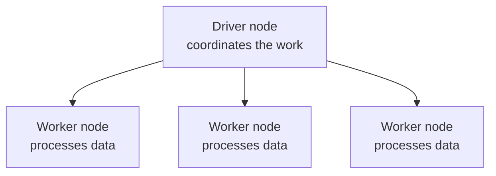
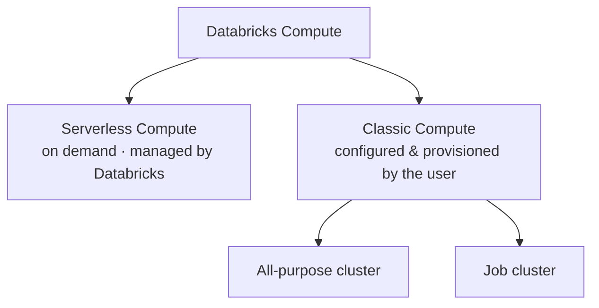

# Compute Types: Serverless vs Classic

This lesson takes a deeper look at the computing resources available in Databricks
for executing data engineering workloads.

## What is "compute"?

In Databricks, the term **compute** refers to a **cluster of virtual machines**. You
will often hear **compute** and **cluster** used interchangeably - in practice they
mean the same thing.

A Databricks cluster typically consists of a **driver node** and one or more
**worker nodes**:

- The **driver node** coordinates the work.
- The **worker nodes** perform the actual data processing.

Together these nodes run workloads such as **ETL pipelines, data analytics, machine
learning, and data science** applications.

## The two types of compute

As seen in the architecture diagram, Databricks offers two types of compute:

## Serverless Compute

Serverless Compute is a **fully managed** compute option provided by Databricks.
Databricks provisions and manages the underlying infrastructure, and the resources
run in a **Databricks-managed cloud environment**.

| Characteristic | Detail |
| --- | --- |
| **Startup** | Databricks maintains a pool of ready-to-use resources, so it starts **very quickly** with minimal wait. |
| **Runtime** | Automatically configured with a Databricks-managed runtime. |
| **Scaling** | Scales up and down **automatically** based on the workload. |
| **Billing** | **Execution-based** - you are charged only while your code runs. When the task/query completes, resources return to the pool and billing stops. **No cost for idle time.** |

!!! tip "Benefits of Serverless"
    Faster startup, reduced operational overhead, and improved productivity. Because
    Databricks handles scaling, maintenance, and upgrades, administrators spend far
    less time managing clusters.

!!! warning "Trade-offs"
    Serverless is production-ready for many common workloads (notebooks, jobs, SQL),
    but it is **more restricted** than Classic Compute: less control over low-level
    configuration and fewer customization options. Despite this, it is increasingly
    used for modern Databricks workloads.

## Classic Compute

Classic Compute is **fully controlled by the customer**. You are responsible for
configuring and managing the cluster, including:

- Choosing the **Databricks runtime version**
- Selecting the **virtual machine types**
- Defining the **number of worker nodes**
- Configuring the **auto-scaling behaviour**

This provides **maximum flexibility and control**, useful when workloads require
specific configurations or advanced customizations.

### All-purpose clusters vs job clusters

There are two main types of Classic Compute:

| | All-purpose cluster | Job cluster |
| --- | --- | --- |
| **Created** | Manually - via UI, CLI, or API | Automatically when a scheduled/automated job starts (if configured to use one) |
| **Lifecycle** | Persistent - can be terminated and restarted anytime | Terminated at the end of each job; cannot be restarted |
| **Best for** | Interactive and ad-hoc analysis | Automated workloads (e.g. ETL or ML at regular intervals) |
| **Sharing** | Can be shared among many users; good for collaboration | Isolated and dedicated to the single job |
| **Cost** | More expensive to run | Cheaper |

!!! note "Rule of thumb"
    **All-purpose clusters** are great for interactive analysis and ad-hoc work;
    **job clusters** are great for repeated production workloads.

## Summary

Databricks offers multiple compute options for different workload types:

- **Serverless Compute** - fully managed, starts quickly, and charges only for
  execution time. A great choice for modern workloads with minimal operational
  effort.
- **Classic Compute** - full control and flexibility, with **all-purpose clusters**
  for interactive work and **job clusters** for automated production workloads.

## What's next

Next we look at the configuration options for a classic cluster. Continue to
[Compute Configuration](03_compute-configuration.md).

## References

- [Classic compute overview](https://learn.microsoft.com/en-us/azure/databricks/compute/)
- [Compute configuration reference](https://learn.microsoft.com/en-us/azure/databricks/compute/configure)
- [Connect to serverless compute](https://learn.microsoft.com/en-us/azure/databricks/compute/serverless/)
- [Configure compute for jobs](https://learn.microsoft.com/en-us/azure/databricks/jobs/compute)
