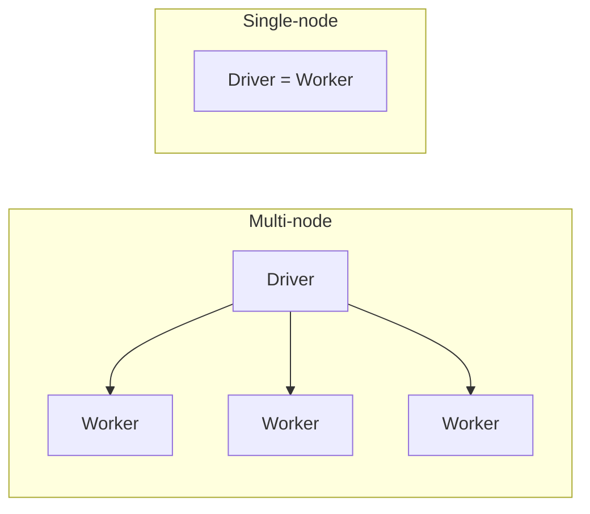

# Compute Configuration

Classic compute lets you configure the cluster yourself - but it is not entirely
straightforward, as Databricks presents many options. This lesson walks through each
one.

## Cluster mode: single-node vs multi-node

| | Multi-node | Single-node |
| --- | --- | --- |
| **Nodes** | One driver + one or more workers | Driver only (acts as both driver and worker) |
| **Scaling** | Horizontally scalable - driver distributes tasks to workers for parallel execution | Cannot be horizontally scaled |
| **Best for** | Larger workloads, large ETL | Lightweight ML and data analysis that doesn't need distributed computing |
| **Sharing** | Supports shared usage | Incompatible with process isolation; not intended for shared usage |

!!! tip
    Databricks recommends always using **multi-node clusters** when shared compute
    is required.

## Access mode

Access mode is a **security feature** that controls who can use the compute and what
data they can access.

| Access mode | Users | Languages | Notes |
| --- | --- | --- | --- |
| **Dedicated** (single-user) | A single user | Python, SQL, Scala, R | - |
| **Standard** (shared) | Multiple users | Python, Scala, SQL | Provides user isolation and enforces Unity Catalog permissions for shared workloads. |

!!! note "Recommendation"
    For production workloads, Databricks recommends **Standard (shared)** access mode
    - it offers process isolation and task preemption, making it more secure and
    reliable.

## Databricks runtime

The Databricks runtime is the set of core libraries that run on clusters. There are
two types:

| Runtime | Contents |
| --- | --- |
| **Databricks Runtime** | An optimized version of Apache Spark with supporting libraries. |
| **Databricks Runtime ML** | Everything above **plus** popular ML libraries: PyTorch, Keras, TensorFlow, XGBoost. |

Both runtimes let you enable or disable **Photon**, a vectorized query engine that
accelerates Apache Spark workloads.

## Auto-termination

Auto-termination prevents unnecessary cost on idle clusters by automatically
terminating a cluster that remains unused for a specified period.

- **Default:** 120 minutes
- **Adjustable range:** 10 minutes to 43,200 minutes (30 days)

## Auto-scaling

When creating a multi-node cluster, you can specify the **minimum and maximum number
of worker nodes**. Auto-scaling automatically adjusts the number of nodes based on
the workload, optimizing utilization - especially useful when workloads are
unpredictable or fluctuate.

## Spot instances

To save cost, you can opt for **spot instances** for worker nodes.

!!! info "How spot instances work"
    - Spot instances are unused VMs / spare capacity in the cloud (Azure here),
      offered at a **cheaper price**.
    - You could be **evicted** if another customer acquires the VM at the usual
      price.
    - When spot instances become unavailable, Databricks attempts to acquire
      replacements or falls back to **on-demand** instances.
    - **Driver nodes are always on-demand** - only worker nodes can use spot
      instances.

## VM (node) types

Azure offers a range of VM types, which Databricks groups into categories:

| Category | Best suited for |
| --- | --- |
| **Memory-optimized** | Memory-intensive workloads, e.g. ML that caches large datasets |
| **Compute-optimized** | Structured streaming where peak processing rate is critical; distributed analytics and data science |
| **Storage-optimized** | Use cases requiring high disk throughput and I/O |
| **General purpose** | Enterprise-grade applications and analytics with in-memory caching |
| **GPU-accelerated** | Deep learning models that are both data- and compute-intensive |

## Cluster policies

With so many options, creating clusters can be overwhelming and may lead to
oversized clusters that exceed budget. **Cluster policies** let administrators set
restrictions and assign them to users or groups.

!!! example "Personal Compute policy"
    A personal compute policy might:

    - Restrict the user to creating only **single-node** clusters
    - Default to the **ML runtime**
    - Limit the **node types**
    - Set **auto-termination** to 20 minutes

    This simplifies the UI, reduces the need for administrator involvement in every
    decision, and helps control cost by limiting cluster size.

## What's next

With the configuration options understood, the next lesson creates a cluster step by
step. Continue to [Creating a Cluster](04_creating-databricks-cluster.md).

## References

- [Classic compute overview](https://learn.microsoft.com/en-us/azure/databricks/compute/)
- [Compute configuration reference](https://learn.microsoft.com/en-us/azure/databricks/compute/configure)
- [Connect to serverless compute](https://learn.microsoft.com/en-us/azure/databricks/compute/serverless/)
- [Configure compute for jobs](https://learn.microsoft.com/en-us/azure/databricks/jobs/compute)
