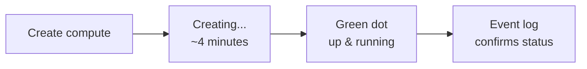

# Creating a Cluster

Now that we understand what a Databricks cluster is and how to configure one, let's
create the cluster required for this course inside the Databricks workspace.

## Opening the create form

1. In the workspace sidebar, click the **Compute** icon.
2. Click **Create compute** under the **All-purpose compute** tab.
3. Databricks shows a **simple form** by default. As data engineers we want to see
   all options, so **toggle off the simple form**.
4. Databricks names the cluster after you by default - click the name to change it.
   In the course it is renamed to **`Databricks Course Cluster`**.

## Configuration walkthrough

### Cluster policy

There are five cluster policies provided by Databricks; any policies you create
appear here too. For this course, leave it as **Unrestricted** so you can step
through and understand every option.

### Single-node vs multi-node

For the early sections of the course we only need a **single-node** cluster - we deal
with a small amount of data, and single-node is **cheaper** to run.

!!! info "Multi-node options (for reference)"
    Selecting multi-node changes the wizard. The key extra options are **worker node
    selection** and **auto-scaling**:

    - Set **minimum** and **maximum** workers based on your workload. For example,
      the cluster might start with **1** worker and add more as needed, never
      exceeding the **maximum** (e.g. 8). You only pay for extra capacity when needed.
    - **Disable auto-scaling** for workloads like streaming, where scale-up time is
      not acceptable for real-time processing - use a fixed number of workers.
    - You can request **spot instances** for worker nodes to save cost, but you may
      be evicted when they become unavailable - recommended only for **non-critical**
      workloads.

For this course we switch back to **single-node**.

### Access mode

The three access modes are **single-user**, **shared**, and **no-isolation shared**.

!!! note "Renaming in progress"
    Databricks is renaming **single user → Dedicated** and **shared → Standard**;
    **no-isolation shared** stays as-is for now. Don't be confused if you see these
    names used interchangeably.

Databricks recommends **Standard (shared)** where possible, **but standard is not
supported for a single-node cluster** - so select **Single user / Dedicated** access
mode.

### Databricks runtime version

Runtimes are grouped into **Standard** and **ML** (ML versions are suffixed `ML`).
For data engineering, choose a **Standard** runtime.

!!! tip "LTS versions"
    Some versions are suffixed **LTS** (Long-Term Support). LTS versions are released
    every six months and supported for **two years** with updates and fixes.

    - **Production** → use LTS versions.
    - **Development** → you can use the latest version.

    The course uses **16.4 LTS** (the latest LTS available at recording).

### Photon

Photon is the high-performance vectorized query engine. Clusters with Photon are
**more expensive**, but for large workloads you may save money overall (queries
finish quicker, so you terminate sooner). For this course, **leave Photon
unselected** - the workload is small.

### Node type

There is a vast array of node types (general purpose, storage/memory-optimized, GPU).
We just need a small one - select **`Standard_DS3_v2`** (14 GB memory, 4 cores), one
of the smallest available.

!!! warning "Node availability varies by region/subscription"
    Some node types may not be available in your region. **Select one without a
    warning sign** next to it. If `DS3_v2` is unavailable, pick another node type
    with **4 cores** - that's all this course needs. A node showing **0 cores
    available** will fail to start. (See [Troubleshooting](05_troubleshooting.md).)

### Auto-termination

Ensure auto-termination is **ticked**, otherwise you must terminate the cluster
manually every time - and you are charged while it runs.

- Minimum value: **10 minutes**
- Suggested: **20–30 minutes** - enough time to watch another video and return to a
  still-running cluster, while still terminating automatically if idle.

### Tags

Databricks adds some tags automatically. You can add your own to help with billing
and attributing cluster cost to a specific project.

### Advanced options

| Option | Use |
| --- | --- |
| **Spark config** | Additional Spark configurations for workloads on this cluster. |
| **Environment variables** | Set environment variables for the cluster. |
| **Logging** | Save logs to a DBFS location or Unity Catalog volume - keep logs longer for compliance/investigation. |
| **Init scripts** | Run scripts at cluster startup, e.g. install Python packages so all developers share the same environment. |

## Creating and monitoring

1. Click **Create compute**. The in-progress icon shows creation is underway.
2. Use the **Event log** to see what's happening; it took about **4 minutes** in the
   course.
3. A **green dot** indicates the cluster is running. Refresh the event log to confirm
   *"cluster is up and running"*.

### Managing clusters

From the **Compute** page you can see all clusters you have access to. With many
clusters you can **search**, **filter** by creator, or **pin** favourites and filter
by *only pinned*.

The cluster summary shows details such as **14 GB active memory, 4 cores**, billed at
**0.75 DBU/hour** (Databricks Units - the Databricks billing unit). From the menu you
can **terminate**, change **permissions**, **restart**, **clone**, or **delete** the
cluster.

### Editing a cluster

Select the cluster name and click **Edit** (top right) to change configurations - for
example, the runtime version.

!!! warning "Some changes require a restart"
    - You can't convert a single-node cluster into a multi-node one.
    - Changing the runtime (e.g. 16.4 → 17) requires **Confirm and restart**. Any
      jobs running at that point are **terminated** by the restart.

Other tabs on the cluster page include **Notebooks** attached to the cluster,
**Libraries** (to install external libraries), the **Event log**, and access to the
**Spark UI**, **driver logs**, and **metrics** for the underlying VMs - your starting
point for investigating cluster issues.

## Terminating the cluster

Always terminate when you're done (it auto-terminates after the configured idle
period anyway).

!!! note "What termination means"
    When you terminate a cluster, the **configuration is saved** so you can restart
    it later, but all the **virtual machines are freed up** and you are **no longer
    charged** from that point on.

## What's next

If you ran into errors creating the cluster, the next lesson helps. Continue to
[Troubleshooting](05_troubleshooting.md).

## References

- [Classic compute overview](https://learn.microsoft.com/en-us/azure/databricks/compute/)
- [Compute configuration reference](https://learn.microsoft.com/en-us/azure/databricks/compute/configure)
- [Connect to serverless compute](https://learn.microsoft.com/en-us/azure/databricks/compute/serverless/)
- [Configure compute for jobs](https://learn.microsoft.com/en-us/azure/databricks/jobs/compute)
