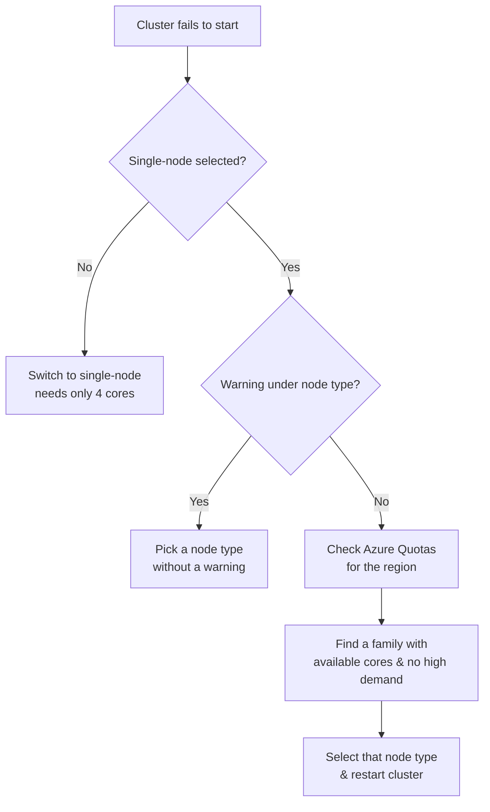

# Troubleshooting Cluster Creation

Some learners report issues creating clusters on a **free** or **pay-as-you-go**
subscription. This lesson explains the errors and how to resolve them.

!!! tip "Already created your cluster?"
    If your cluster started successfully, you can skip this lesson.

## The errors you might see

When creating a cluster you may see errors such as:

- **Quota exceeded**, or
- **The VM you specified is not available in your region**.

These two errors are related but slightly different. The root cause is usually
**insufficient core quota for a specific VM family in your region**.

## Step 1 - Use a single-node cluster

Depending on your subscription you may have between **4 and 10 cores** available.
Make sure you selected a **single-node** cluster - a single-node cluster with a small
node needs only **4 cores**.

!!! warning
    Sometimes Azure only allows your 4 cores to be used against a **certain VM family
    type** in a specific region.

## Step 2 - Read the actual error

1. Hover over the error icon, or open the **Event log**.
2. Find the failed **"add nodes"** event and click it to see the full message -
   typically: *"The VM size you specified is not available… the operation could not
   be completed as it resulted in exceeding the approved quota for this family type
   (e.g. Standard DDSv5 family)."*
3. On the **Configuration** screen, the node type may also show a helpful Azure
   warning such as **estimated available: 0, requested: 4**.

!!! note
    You don't always get the inline warning - you may still hit the error only when
    the cluster starts. So it's worth checking quota directly (Step 4).

## Step 3 - Pick a node type without a warning

On the Configuration screen, select a different node type that has **no warning sign**
- for example, **`Standard_DS3_v2`** or **`Standard_D3_v2`**. This often succeeds, but
because the inline list isn't always up to date, verify via the Azure portal quota
page if needed.

## Step 4 - Check quotas in the Azure portal

1. In the Azure portal, search for **Quotas** in the search bar.
2. Select **Compute**.
3. Filter by your **region** (the course workspace is in **UK South**).

You will see core availability per **CPU family**:

| Example family | Cores available | Meaning |
| --- | --- | --- |
| **Standard BS family** | 10 (using 0) | Can request up to 10 cores |
| **Standard DDSv5 family** | 0 of 0 | No cores available → cause of the error |
| **Standard DSv2 family** | 20 (using 0) | Available, but may be in **high demand** |

!!! info "Reading the family name"
    To map a node like **`Standard_D4ds_v5`** to its family, **ignore the number in
    the second part** of the string and keep the version. So `D4ds_v5` →
    **Standard DDSv5**. Likewise `DS3_v2` → **Standard DSv2**.

## Step 5 - Watch out for "high demand" families

Azure sometimes runs promotions on specific families, making them high in demand.
When you hover over the quota line you may see *"Standard DSv2 family CPUs are high in
demand in the UK South region."* You can still try one of these, but it may fail.

!!! tip "Best practice"
    Pick a family that has **cores available** **and** is **not in high demand**
    (no warnings). In the course, the **Standard F family (e.g. `Standard_F4`)** was
    available with no warnings and started successfully.

## Recap

1. Make sure you're creating a **single-node** cluster.
2. Make sure there are **no warnings/errors** under the node type when configuring.
3. If you still get an error, open **Quotas** and find a family with **cores
   available** for your region.
4. Prefer a family with **no warnings at all**; if one has a warning you can try it,
   but fall back to a clean one if it fails.

This should help you successfully create the cluster.

## References

- [Classic compute overview](https://learn.microsoft.com/en-us/azure/databricks/compute/)
- [Compute configuration reference](https://learn.microsoft.com/en-us/azure/databricks/compute/configure)
- [Connect to serverless compute](https://learn.microsoft.com/en-us/azure/databricks/compute/serverless/)
- [Configure compute for jobs](https://learn.microsoft.com/en-us/azure/databricks/jobs/compute)
