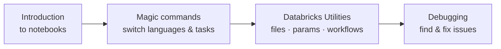

# Databricks Notebooks - Section Overview

Welcome to a new section focused on **Databricks Notebooks**. Notebooks are where you
will spend most of your time as a data engineer in Databricks - they are where you
**write code, explore data, and build your pipelines**.

## What this section covers

| Lesson | Focus |
| --- | --- |
| **[Working with Notebooks](02_notebooks.md)** | An introduction to notebooks and how they work in Databricks. |
| **[Magic Commands](03_magic-commands.md)** | Switch between languages and run different types of operations. |
| **[Databricks Utilities](04_utilities.md)** | Interact with files, parameters, and workflows. |
| **[Debugging Notebooks](05_debugging.md)** | Common debugging techniques to identify and fix issues. |

By the end of this section you will be comfortable working with notebooks as your
**primary development environment**. Let's get started.

## References

- [Basic editing in Databricks notebooks](https://learn.microsoft.com/en-us/azure/databricks/notebooks/basic-editing)
- [Navigate the Databricks notebook and file editor](https://learn.microsoft.com/en-us/azure/databricks/notebooks/notebook-editor)
- [Run Databricks notebooks](https://learn.microsoft.com/en-us/azure/databricks/notebooks/run-notebook)
- [Databricks Utilities reference](https://learn.microsoft.com/en-us/azure/databricks/dev-tools/databricks-utils)
