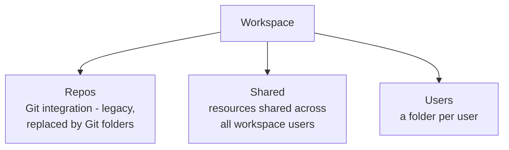

# Working with Notebooks

Databricks offers a **Jupyter-style notebook environment** with additional features to
streamline development. A notebook is essentially a **collection of cells** that
execute commands on a Databricks cluster.

## Before you start: attach a cluster

To execute commands, a notebook must be **attached to a running cluster**. If your
cluster is terminated (as in the previous section), go to **Compute** and click the
**play / start** button, then confirm.

## Where notebooks live

Notebooks live under **Workspace**, which contains three folders:



| Folder | Purpose |
| --- | --- |
| **Repos** | Git integration - a **legacy** feature being replaced by **Git folders**. Ignore for now. |
| **Shared** | Share resources/notebooks among all users in the workspace. |
| **Users** | One folder per user who has access to the workspace. |

!!! tip "Stay organised"
    Create the notebook under your **Users** folder. The course adds a folder named
    `Databricks Course` and a sub-folder `Introduction to Notebooks` to keep
    everything organised.

## Creating a notebook

1. **Right-click** a folder → **Create → Notebook**, or use the **Create** button
   (top right).
2. Give it a meaningful name, e.g. `01.Notebooks Introduction` (Databricks assigns a
   default name otherwise).
3. The **default language** is set to **Python**. This applies to all cells unless
   overridden in an individual cell.

!!! note "Multi-tab preview"
    Databricks has a preview feature for keeping multiple tabs open. It's useful, but
    can be turned off to keep things simple while learning.

## Running code

The first cell is a Python cell. To run cells you can:

| Method | How |
| --- | --- |
| **Play button** | Click the play icon on the cell. |
| **Shift + Enter** | Run the cell **and** create a new cell below. |
| **Run menu** | *Run selected cells* or *Run all*. |
| **Run all** | Execute every cell in the notebook. |

!!! tip "Keyboard shortcuts"
    See all shortcuts via **Help → Keyboard shortcuts**.

### Running a single line

To run just one statement within a multi-line cell, **select the line**, then use the
dropdown → **Run selected text**, or press **Ctrl + Shift + Enter**.

## Cell types: code vs text (Markdown)

Hover between cells to add a **code** or **text** cell above or below.

- A **text cell** begins with the magic command **`%md`** (Markdown). That's the only
  difference between a text cell and a code cell - remove `%md` and it becomes a code
  cell.
- Use Markdown to add **headers** (`#`, `##`), **bullet points** (`-`), bold/italic
  text, links, and images. A formatting toolbar is also available.

!!! tip "Document as you go"
    Good documentation drives the notebook's **table of contents** (see the side
    menu), making large notebooks far easier to navigate.

## Mixing languages with magic commands

The default language is Python, but **magic commands** let you switch a cell to
another language:

```python
%sql
SELECT 1 AS demo;
```

- Switch a cell's language from the cell-language dropdown, or type the magic command
  directly (e.g. `%sql`, `%scala`).
- `%`-prefixed commands are **magic commands** - `%sql` switches a Python-default
  notebook's cell to SQL, returning a result table (row set).
- **Run all** executes the whole notebook even when cells mix Python, SQL, and Scala
  - the power of Databricks notebooks. See [Magic Commands](03_magic-commands.md).

## Menu options worth knowing

| Menu | Highlights |
| --- | --- |
| **File** | **Import**/**Export** files & folders (Python, HTML, source `.py`/`.sql`/`.scala`, or **DBC** proprietary format); **Clone** a notebook. |
| **View** | Change **cell layout** (e.g. code and results side-by-side, or standard). |
| **Run** | Run and debug code; **Clear state** (reset variables), **Clear outputs**, or **Clear state and run all** for a clean run. |
| **Help** | Keyboard shortcuts and more. |

## The side menus

### Left side

| Item | Purpose |
| --- | --- |
| **Table of contents** | Auto-populated from headings; jump between sections of large notebooks. |
| **Workspace** | Navigate the workspace and switch notebooks without leaving the current one. |
| **Catalog** | Browse tables and volumes in Unity Catalog / Hive Metastore. |

### Right side

| Item | Purpose |
| --- | --- |
| **Comments** | Comment on the notebook when collaborating. |
| **MLflow Experiments** | View experiment runs. |
| **Version history** | Databricks auto-versions the notebook; you can view and **restore** previous versions. |
| **Variables** | Inspect variables defined in the notebook. |
| **Environment** | For **serverless compute** only. |
| **AI assistant** | Ask questions - also available in every cell. |

!!! warning "Version history vs Git"
    The built-in version history is handy for a single notebook, but for **team
    collaboration** use **Git** for version control rather than relying on the
    built-in history.

### Top actions

You can **Schedule** the notebook via Databricks/Lakeflow Jobs, and **Share** it with
anyone who has access to the workspace.

## What's next

Next we dive deeper into magic commands. Continue to [Magic Commands](03_magic-commands.md).

## References

- [Basic editing in Databricks notebooks](https://learn.microsoft.com/en-us/azure/databricks/notebooks/basic-editing)
- [Navigate the Databricks notebook and file editor](https://learn.microsoft.com/en-us/azure/databricks/notebooks/notebook-editor)
- [Run Databricks notebooks](https://learn.microsoft.com/en-us/azure/databricks/notebooks/run-notebook)
- [Databricks Utilities reference](https://learn.microsoft.com/en-us/azure/databricks/dev-tools/databricks-utils)
