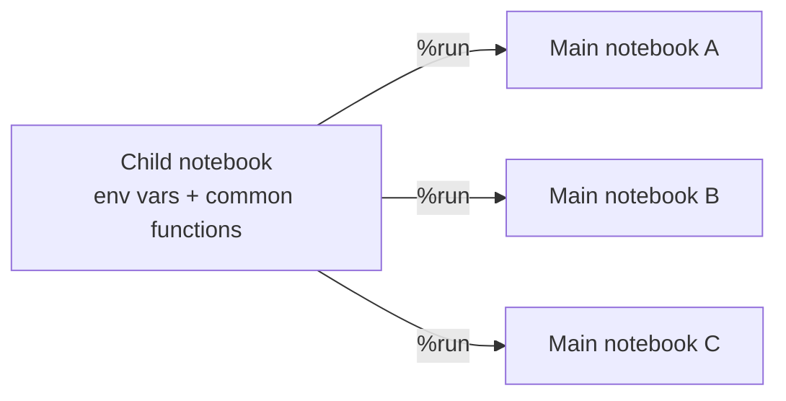

# Magic Commands

Databricks offers a number of **magic commands** to help interact with notebook cells
and achieve specific tasks. A magic command is any command that starts with `%`.

## The commonly used magic commands

| Magic command | Purpose |
| --- | --- |
| `%python`, `%sql`, `%scala`, `%r` | Switch the cell to run in that language - lets a single notebook mix multiple languages. |
| `%md` | Create a **Markdown** (documentation) cell - headings, structure, images, links. |
| `%fs` | Interact with the **Databricks File System** (list, copy, move files, etc.). |
| `%sh` | Run **shell commands** on the driver node (e.g. view processes, install packages). |
| `%pip` | Manage **Python libraries** - install packages from PyPI or other sources. |
| `%run` | **Include/import another notebook** into the current one. |

## `%fs` - file system

`%fs` lets you run basic file system commands. The cell must **start** with `%fs`.

```python
%fs ls /
```

```python
%fs ls /databricks-datasets
```

- Use `ls` to list files/folders; you can also use `cp` (copy) and `mv` (move).
- The `dbfs` prefix is optional.
- Single-line (`%fs ls /path`) and two-line forms both work - what matters is that
  the cell **starts** with `%fs`.

!!! info "Sample datasets"
    Databricks makes many datasets available under `/databricks-datasets`
    (COVID data, airlines, Amazon, bike-sharing, and more) for experimentation.

## `%sh` - shell commands

Run shell commands on the **driver node**:

```python
%sh ps
```

This lists all running processes (R, Python, Java, etc.).

## `%pip` - Python libraries

Install or list Python packages in the notebook environment:

```python
%pip list
```

```python
%pip install faker
```

- `%pip list` shows already-installed libraries (Seaborn, Pandas, NumPy, etc.).
- `%pip install <package>` installs a new library - e.g. **Faker**, which generates
  dummy data for testing.

## `%run` - modularize with other notebooks

`%run` imports another notebook so its variables and functions become available - a
key technique to **modularize code**, avoid duplication, and keep notebooks
maintainable. This is one of the most commonly used magic commands in the industry.



### Example

1. Create a child notebook, e.g. `2.1 Environment Variables and Functions`, defining
   a variable and a function:

    ```python
    env = "dev"

    def print_env_info():
        import sys
        print(sys.version)
        # ... also print the Databricks runtime version
    ```

2. In the main notebook, include it with `%run` and the **path** to the child
   notebook. Wrap the path in quotes if it contains spaces:

    ```python
    %run "/Users/.../2.1 Environment Variables and Functions"
    ```

3. The child's variable and function are now available:

    ```python
    env                 # -> 'dev'
    print_env_info()    # -> prints Python and Databricks runtime versions
    ```

!!! tip "Use relative paths in production"
    Hard-coded full paths break when moving between environments. Use **relative
    paths** instead:

    - `./Notebook` - a notebook in the **same** folder.
    - `../Notebook` - a notebook one folder **up**.

## What's next

Next we look at Databricks Utilities, a more flexible, programmatic alternative to
some magic commands. Continue to [Databricks Utilities](04_utilities.md).

## References

- [Basic editing in Databricks notebooks](https://learn.microsoft.com/en-us/azure/databricks/notebooks/basic-editing)
- [Navigate the Databricks notebook and file editor](https://learn.microsoft.com/en-us/azure/databricks/notebooks/notebook-editor)
- [Run Databricks notebooks](https://learn.microsoft.com/en-us/azure/databricks/notebooks/run-notebook)
- [Databricks Utilities reference](https://learn.microsoft.com/en-us/azure/databricks/dev-tools/databricks-utils)
- [Orchestrate notebooks and modularize code in notebooks](https://learn.microsoft.com/en-us/azure/databricks/notebooks/notebook-workflows)
