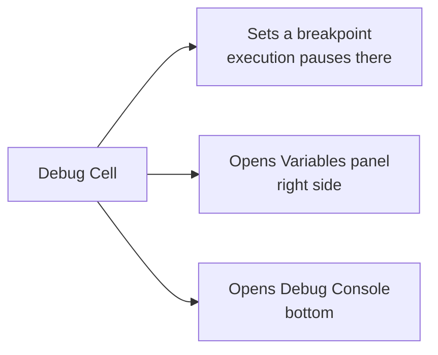

# Debugging Notebooks

Databricks notebooks include **debugging** capabilities - a recently introduced,
still-evolving feature. Debugging means **finding and fixing issues** in your code,
and it's also a great way to understand how your code runs step by step.

## Requirements

!!! warning "Where the debugger works"
    - Only available for **Python** cells (not SQL or Scala).
    - The notebook must be attached to a cluster with a supported runtime:
      **Databricks Runtime 13.3 LTS or later**, or any **serverless** compute.
    - On an older runtime or a non-Python cell, the debug option won't appear.

### Enabling the debugger

Go to **Settings** (top-right) → **Developer** → enable **Python notebook interactive
debugger**. Once enabled, the debug option appears in your notebook cells.

## What "Debug Cell" does

Open a cell's dropdown → **Debug Cell**. This does three things:



!!! tip "Start from a clean state"
    If you see stale variable values, **Clear state and outputs** first, then start
    the debugger so you begin fresh.

## The debug controls

| Action | Shortcut | What it does |
| --- | --- | --- |
| **Go to Next Line** | F8 | Step over to the next line. |
| **Continue Execution** | F7 | Run until the next breakpoint. |
| **Step In** | F9 | Step **into** a function call to debug inside it. |
| **Step Out** | - | Finish the current function and return to the caller. |

Click in the **left margin** of a line to add or remove a breakpoint (a dot appears).

## Demo 1 - stepping through statements

Consider code that calculates an item's final price (with a deliberate bug):

```python
item_price = 120
tax_rate = 20          # percent
discount = 10

tax = item_price * tax_rate / 100      # 24  (correct)
item_price_with_tax = item_price - tax # BUG: should be +
final_price = item_price_with_tax - discount

print(final_price)     # prints 86, but should be 134
```

Running it prints **86**. Expected: $120 + 20% tax = $144, minus $10 discount = **$134**.

**Debugging the bug:**

1. **Debug Cell** pauses at the first line; the **Variables** panel shows
   `item_price = 120`.
2. **Go to Next Line** repeatedly (or set a breakpoint and **Continue** to jump to a
   suspect spot).
3. `tax` is calculated as **24** - correct.
4. The next step shows `item_price_with_tax = 96` - **wrong**. Applying tax should
   *increase* the price, so the `-` should be a `+`.

### Using the Debug Console

The debug console is a Python interpreter aware of the current context (variables,
etc.). Use it to test a fix without rerunning everything:

```python
print(tax)                                 # 24
item_price_with_tax = item_price + tax     # 144
final_price = item_price_with_tax - discount
print(final_price)                         # 134
```

This confirms the single `-` → `+` change fixes the code. Make the change, stop the
debugger, and rerun → **134**.

## Demo 2 - Step In / Step Out

Now the same logic is wrapped in a function (with the same bug):

```python
def calculate_final_price(item_price, tax_rate, discount):
    tax = item_price * tax_rate / 100
    item_price_with_tax = item_price - tax   # BUG: should be +
    return item_price_with_tax - discount

item_price = 120
tax_rate = 20
discount = 10
final_price = calculate_final_price(item_price, tax_rate, discount)
print(final_price)   # 86
```

!!! note "Run the function cell first"
    After clearing state, **execute the function definition cell** before debugging
    the calling cell - otherwise the function won't exist and debugging errors out.

**Stepping into the function:**

1. **Debug Cell** on the calling cell. If you only use **Go to Next Line** over the
   function call, you skip past it without seeing the bug.
2. Instead, on the function-call line, use **Step In (F9)** to go **inside** the
   function.
3. The **Variables** panel now shows the function's **local** variables
   (`item_price`, `tax_rate`, `discount`) marked as *local*, separate from the
   **global** variables of the main program.
4. Step through: `tax = 24` (local), then `item_price_with_tax = 96` - the bug again
   (`-` should be `+`).
5. Use **Step Out** to finish the function and return to the main program, then
   continue stepping there.

## Summary

The Databricks debugger lets you set breakpoints, **continue to a breakpoint**, **step
line by line**, **step in/out of functions**, inspect variables (global and local) in
the **Variable Explorer**, and test snippets in the **Debug Console** - much like an
IDE such as VS Code or PyCharm.

!!! info "Still evolving"
    The notebook debugger is still slightly behind dedicated IDEs, but Databricks
    keeps adding features.

This concludes the Databricks Notebooks section.

## References

- [Basic editing in Databricks notebooks](https://learn.microsoft.com/en-us/azure/databricks/notebooks/basic-editing)
- [Navigate the Databricks notebook and file editor](https://learn.microsoft.com/en-us/azure/databricks/notebooks/notebook-editor)
- [Run Databricks notebooks](https://learn.microsoft.com/en-us/azure/databricks/notebooks/run-notebook)
- [Databricks Utilities reference](https://learn.microsoft.com/en-us/azure/databricks/dev-tools/databricks-utils)
