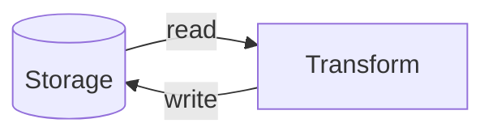

# Introduction to Unity Catalog

So far the course has focused on the Databricks **platform** - architecture, compute,
and notebooks. The next step is understanding how data is **stored, accessed, and
governed** when building real data engineering solutions.

## Why data governance matters

Any data engineering project involves three fundamental steps:

1. **Read** data from a storage system.
2. Apply **transformations**.
3. **Write** the transformed data back to storage.

Databricks can read/write from many storage solutions, but in modern cloud
architectures **cloud object storage** is the standard for data lakehouse
implementations:

| Cloud provider | Object storage |
| --- | --- |
| **Azure** (used in this course) | Azure Data Lake Storage Gen2 |
| **AWS** | Amazon S3 |
| **GCP** | Google Cloud Storage |

The compute engine throughout is **Apache Spark**.

## From the legacy solution to Unity Catalog

Databricks' original approach to accessing data was based on the **Databricks File
System (DBFS)** and the **Hive Metastore**. This was widely adopted but had
challenges around **data security and governance**.

To address these, Databricks launched **Unity Catalog** in **late 2022**.

!!! info "Legacy vs Unity Catalog"
    - Databricks now considers DBFS + Hive Metastore **legacy** and recommends Unity
      Catalog for all new projects.
    - The legacy solution is still supported for backward compatibility in many
      existing workspaces, so you may still see Hive metastore or DBFS references in
      older training material, code, or platform screens.
    - For new projects, design around Unity Catalog objects: catalogs, schemas,
      tables, views, volumes, external locations, and storage credentials.

This course focuses entirely on **Unity Catalog**.

## What Unity Catalog provides

Unity Catalog is a **central governance solution** for all your data in Databricks. At
a high level it lets you:

- Organize data in a **consistent** way.
- Control **who can access** data and enforce **security rules**.
- Apply **governance** across different users and workloads.
- Work **across workspaces** and integrate directly with Databricks compute.

### Data objects it manages

| Object | Use |
| --- | --- |
| **Tables** | Structured data. |
| **Views** | Saved query logic; simplified or restricted views of data. |
| **Functions** | Abstract and reuse transformation logic. |
| **Volumes** | A **governed** way to work with files in cloud object storage - recommended for unstructured/semi-structured data. |

In short, Unity Catalog gives a **unified solution** for accessing both file-based and
table-based data while applying consistent access control across all datasets.

## What's next

The rest of this section covers how Unity Catalog is **structured** and **configured**
so we can securely connect to cloud storage for the project. Continue to
[The Unity Catalog Object Model](02_object-model.md).

## References

- [What is Unity Catalog?](https://learn.microsoft.com/en-us/azure/databricks/data-governance/unity-catalog/)
- [Unity Catalog securable objects](https://learn.microsoft.com/en-us/azure/databricks/data-governance/unity-catalog/securable-objects)
- [Connect to cloud object storage using Unity Catalog](https://learn.microsoft.com/en-us/azure/databricks/connect/unity-catalog/)
- [Create a storage credential for Azure Data Lake Storage](https://learn.microsoft.com/en-us/azure/databricks/connect/unity-catalog/cloud-storage/storage-credentials)
