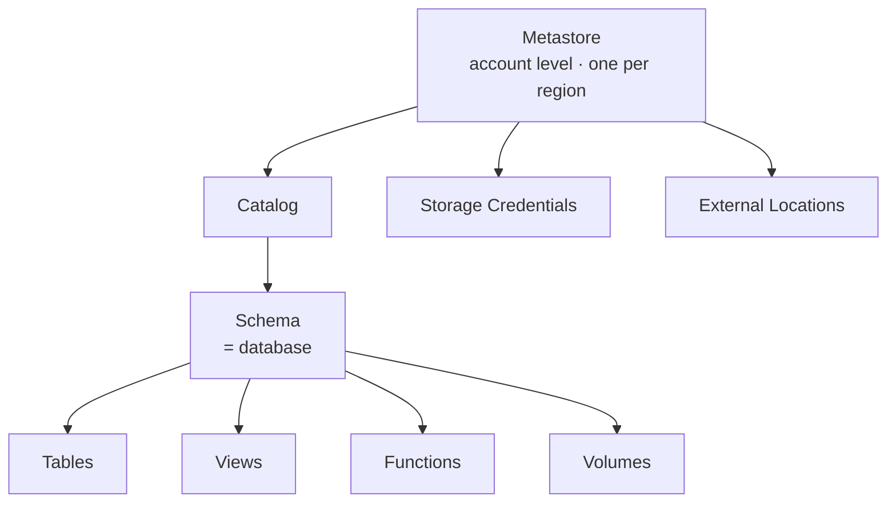

# The Unity Catalog Object Model

This lesson covers the main objects introduced by Unity Catalog and how they relate,
so you have a clear mental model before using them in the project.

## The object hierarchy

### Metastore

The **top-level container** for all metadata in Unity Catalog. It lives at the
**Databricks account level**.

- You can create **only one metastore per Azure region**.
- One or more workspaces can be attached to the same metastore.
- At creation it can optionally be paired with an ADLS Gen2 container for **default
  storage** (though this is **not** recommended - see [Creating a Metastore](04_create-metastore.md)).

### Catalog

A **logical container** within the metastore used to organize datasets. A metastore
can have one or more catalogs. Common strategies:

- One catalog **per business domain**, or
- One catalog **per environment** (development, testing, production).

### Schema

The next level container within a catalog.

!!! note "Schema = database"
    Schemas and databases are technically the same thing in Databricks. The
    historically common term was *database*, but the **recommended term is now
    schema** (to avoid confusion with traditional database systems). `CREATE DATABASE`
    still works, but prefer **`CREATE SCHEMA`**.

A schema can contain **tables, views, functions, and volumes**.

## Tables: managed vs external

Tables represent structured data (rows and columns). They can be **managed** or
**external**:

| | Managed table | External table |
| --- | --- | --- |
| **Managed by** | Unity Catalog manages **both** metadata and data files | Registered in UC, but data managed **outside** Databricks (typically cloud storage) |
| **On `DROP`** | **Both** metadata and data files deleted | **Only** metadata removed; data left untouched |
| **Format** | **Delta Lake only** | Any format (Parquet, CSV, JSON, …) |
| **Best for** | Data fully owned by Databricks | Data produced by external systems (e.g. Azure Data Factory) that Databricks only consumes |

!!! warning "Managed tables use Delta Lake"
    You **cannot** create managed tables in Parquet, CSV, JSON, etc. For those
    formats you must use **external** tables.

## Views, functions, and volumes

- **Views** - save query logic and expose simplified or restricted versions of data
  (like other database systems).
- **Functions** - abstract and reuse transformation logic.
- **Volumes** - a governed way to work with files in cloud object storage, commonly
  for unstructured/semi-structured data. Like tables, volumes can be **managed** (UC
  manages them fully) or **external** (existing containers/paths managed outside
  Databricks but registered in UC). Volumes are the **recommended approach** for
  accessing files in modern Databricks projects.

## Supporting and additional objects

Beyond the core objects, Unity Catalog includes:

| Object | Purpose |
| --- | --- |
| **Storage credentials** | Securely connect UC to cloud storage accounts beyond the metastore's default. |
| **External locations** | Combine a storage credential with a storage container. |
| **Service credentials** | Hold credentials of external cloud services (e.g. an AWS service). |
| **Connections** | Read-only access to an external database (MySQL, PostgreSQL) via **Lakehouse Federation**. |
| **Share / Recipient / Provider** | Used for **Delta Sharing**. |

!!! info "Scope for this project"
    We'll create and configure **storage credentials** and **external locations** in
    the next lessons. The other objects (service credentials, connections, Delta
    Sharing) aren't used in this project - it's just useful to recognise their names.

## Summary

The Unity Catalog hierarchy is: **metastore → catalogs → schemas → tables / views /
functions / volumes**, plus supporting objects (**storage credentials**, **external
locations**) for secure cloud storage access, and additional objects (service
credentials, connections, share/recipient/provider) for accessing or sharing data
with other services.

## What's next

Next we inspect the metastore configuration from the account console. Continue to
[The Account Console & Metastore](03_account-console.md).

## References

- [What is Unity Catalog?](https://learn.microsoft.com/en-us/azure/databricks/data-governance/unity-catalog/)
- [Unity Catalog securable objects](https://learn.microsoft.com/en-us/azure/databricks/data-governance/unity-catalog/securable-objects)
- [Connect to cloud object storage using Unity Catalog](https://learn.microsoft.com/en-us/azure/databricks/connect/unity-catalog/)
- [Create a storage credential for Azure Data Lake Storage](https://learn.microsoft.com/en-us/azure/databricks/connect/unity-catalog/cloud-storage/storage-credentials)
