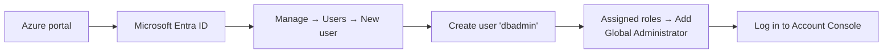

# The Account Console & Metastore

The metastore is the top-level container in the Unity Catalog object model. This
lesson shows how to log in to the **Databricks Account Console** and inspect the
metastore configuration for your workspace.

!!! info "Most learners don't need to configure anything"
    Databricks automatically creates a Unity Catalog metastore for all Azure
    subscriptions created **on or after November 2023**. Unless you're on a much older
    subscription, you already have a metastore and your workspace is attached to it -
    you just need to know **how to check**.

## Key facts about the metastore

- Only **one metastore per Azure region**; all workspaces in that region can attach to
  it.
- The metastore is configured from the **Databricks Account Console**, **not** the
  workspace.
- Account Console URL: **`accounts.azuredatabricks.net`**

## Checking attachment from the workspace

The easiest way to check whether your workspace is attached to a metastore is to run
a SQL command in a notebook:

```sql
SELECT current_metastore();
```

- Create a folder (e.g. `Introduction to Unity Catalog`) and a new notebook, set the
  default language to **SQL**, and run the command.
- **Attached:** you get the metastore's ID (a GUID).
- **Not attached:** you get an error stating the workspace is not attached to a
  metastore and must be enabled with Unity Catalog.

If you can see the metastore ID, **you don't need to do anything further** - but it's
still worth understanding the Account Console UI.

## Logging in to the Account Console

To access the Account Console you must log in with a user that exists in **Microsoft
Entra ID** **and** has **Global Administrator** privileges.

!!! warning "Personal subscriptions often need a dedicated admin user"
    On a personal Azure subscription, the user you normally use for the Azure portal
    is frequently **not** a native user in Entra ID (it appears as an external
    `#EXT#` guest with a longer domain). Logging in directly gives an error like
    *"selected user account does not exist in this tenant."* The fix is to create a
    dedicated admin user.

### Creating an admin user



1. Azure portal → **Microsoft Entra ID** → **Manage → Users**.
2. **New user → Create new user**, e.g. `dbadmin`, with a display name and password.
3. Open the user → **Assigned roles → Add assignment** → search **Global
   Administrator** → **Add**.
4. Use this `dbadmin@<your-domain>` user to log in at `accounts.azuredatabricks.net`
   (you'll be prompted to change the password and set up MFA on first login).

## Inspecting the metastore in the Account Console

Once logged in:

| Sidebar menu | What you see |
| --- | --- |
| **Workspaces** | All workspaces in the account, and which **metastore** each is attached to (e.g. `metastore_uksouth`, created automatically by Databricks). |
| **Catalog** | All metastores. A **Create metastore** button lets you create one. |

!!! note "One metastore per region"
    Because a region allows only one metastore, you can't create a second metastore in
    a region that already has one (e.g. UK South) - but you could create one in a
    different region (e.g. UK West).

From a metastore you can also **manage permissions** - assign a **metastore admin**,
and create/manage users, service principals, and groups via user management.

## What's next

If your workspace **isn't** attached to a metastore (older subscription), the next
lesson shows how to create one. Continue to [Creating a Metastore](04_create-metastore.md).

## References

- [What is Unity Catalog?](https://learn.microsoft.com/en-us/azure/databricks/data-governance/unity-catalog/)
- [Unity Catalog securable objects](https://learn.microsoft.com/en-us/azure/databricks/data-governance/unity-catalog/securable-objects)
- [Connect to cloud object storage using Unity Catalog](https://learn.microsoft.com/en-us/azure/databricks/connect/unity-catalog/)
- [Create a storage credential for Azure Data Lake Storage](https://learn.microsoft.com/en-us/azure/databricks/connect/unity-catalog/cloud-storage/storage-credentials)
