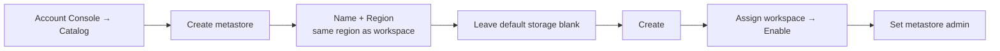

# Creating a Metastore

This lesson demonstrates how to create a Unity Catalog metastore and attach a
workspace to it.

!!! info "Most learners can skip the hands-on steps"
    On subscriptions created **on or after November 2023**, Databricks automatically
    creates the metastore and attaches workspaces at the time the **first** workspace
    is deployed in a region. If that's you, you don't need to perform these steps - but
    it's worth watching to understand the process. (The demo uses an **older**
    subscription that has no metastore.)

## Confirming there's no metastore

Run the check from a notebook:

```sql
SELECT current_metastore();
```

On an unattached workspace this returns an error: *"current metastore requires Unity
Catalog enabled"* - confirming the workspace isn't attached.

In the Account Console (`accounts.azuredatabricks.net`, logged in as the `dbadmin`
Global Administrator user from the [previous lesson](03_account-console.md)):

- **Catalog** shows **no metastores**.
- **Workspaces** shows the workspace with **no metastore** attached.

## Creating the metastore



1. **Catalog → Create metastore**.
2. Provide a **name** and a **region**.

    !!! warning "Region must match"
        The metastore and the workspace must be in the **same region**. You can only
        assign workspaces from that region to the metastore. (The demo uses **UK
        South** to match the workspace.)

3. **Leave the ADLS Gen2 path (default storage) blank.**

    ??? info "Why not set a default storage for the metastore?"
        Databricks recommends **against** a metastore-level default storage, because
        it becomes a "dumping ground" for all data across catalogs/schemas that don't
        specify a managed location. Instead, assign a managed location **per catalog
        or schema**. This lets you:

        - Manage access to each container separately.
        - Do capacity planning and see how much storage each business area uses.

    Because no ADLS path is provided, you can also leave the **access connector**
    blank.

4. Click **Create**.

## Attaching the workspace

1. After creation, **select the workspace(s)** to assign and click **Assign**, then
   **Enable**.
2. Refresh - the workspace now shows the new metastore attached.

## Granting metastore access to your workspace user

You normally log in to the **workspace** with a different user than the `dbadmin`
account used for the Account Console. That workspace user has **no access** to the new
metastore yet, so grant it.

1. Go to the metastore's **Metastore admin** section (currently the `dbadmin` user).
2. Click **Edit** and choose the new admin - your normal workspace user, a **group**,
   or **all users**.

!!! warning "Learning only"
    The demo assigns the **All account users** group as metastore admin for
    convenience. **Never** do this on a real project - you would not grant all account
    users metastore-admin rights.

After refreshing, the workspace is attached to the metastore and ready to use.

## What's next

With the metastore in place, the next lesson covers the concepts for accessing cloud
storage. Continue to [Accessing Cloud Storage: Concepts](05_cloud-storage.md).

## References

- [What is Unity Catalog?](https://learn.microsoft.com/en-us/azure/databricks/data-governance/unity-catalog/)
- [Unity Catalog securable objects](https://learn.microsoft.com/en-us/azure/databricks/data-governance/unity-catalog/securable-objects)
- [Connect to cloud object storage using Unity Catalog](https://learn.microsoft.com/en-us/azure/databricks/connect/unity-catalog/)
- [Create a storage credential for Azure Data Lake Storage](https://learn.microsoft.com/en-us/azure/databricks/connect/unity-catalog/cloud-storage/storage-credentials)
