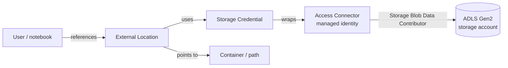
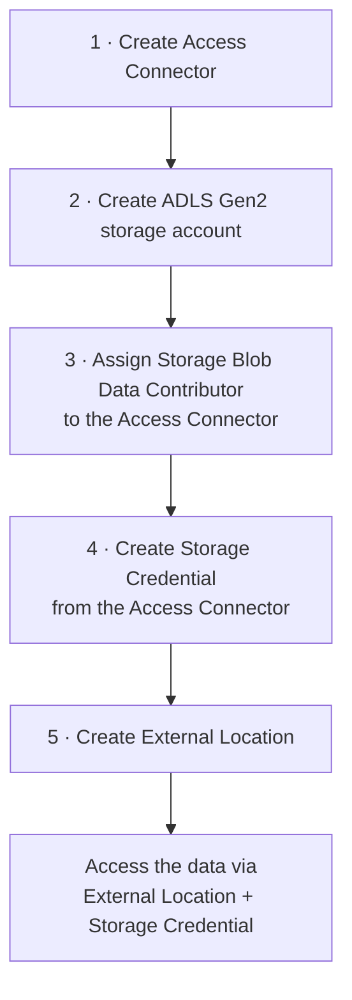

# Accessing Cloud Storage: Concepts

Now that the metastore exists, this lesson explains **how Unity Catalog reads and
writes data from cloud storage** - the concepts behind storage credentials and
external locations. The next two lessons put it into practice.

## Why per-catalog storage (not metastore default)

As covered earlier, we **don't** assign a default storage to the whole metastore -
that funnels all data into a single container and becomes hard to maintain. Instead,
assign specific storage containers per **catalog** or even per **schema**.

To do this we need two Unity Catalog objects: a **storage credential** and an
**external location**.

## Storage credential

A **storage credential** is an authentication/authorization mechanism for accessing
data in Azure storage on behalf of users. It can be created with a **managed
identity** or a **service principal**.

!!! info "New to Azure?"
    Managed identities and service principals are mechanisms for authenticating and
    authorizing Azure resources **securely**, without manually managing credentials.

## External location

An **external location** combines a **storage credential** with a **cloud storage
container** to grant access to that specific container.

- You can create as many external locations as you need.
- You can create sub-folders within the container and assign them per catalog/schema -
  keeping each catalog's/schema's data **separate and organized**.

!!! warning "The word 'external' is overloaded"
    In Databricks, *external* means different things in different places. For an
    **external location**, *external* simply means a storage **other than the default
    storage** attached to the metastore (it is unrelated to external tables/volumes).

## How it fits together

When a user references an external location, Unity Catalog knows which storage
credential to use; if that credential has access to the storage account,
authentication succeeds.

### Access control

You can apply access control to **both** the storage credential and the external
location, letting administrators manage storage access at a granular level. If a user
lacks access to either, the request fails and Unity Catalog does **not** attempt to
authenticate.

### Access Connector for Azure Databricks

To make the storage credential easy to set up, Azure offers a first-party service
called **Access Connector for Azure Databricks**, which connects a managed identity to
a Databricks account. We assign it the **Storage Blob Data Contributor** role on the
data lake so it can access the data, then create the storage credential from the
access connector - so the credential inherits that access.

## Implementation steps

| Step | Where | Action |
| --- | --- | --- |
| **1** | Azure | Create the **Access Connector** (a new one, kept separate for this part of the course). |
| **2** | Azure | Create a new **ADLS Gen2** storage account (one you fully control - not the Databricks-managed one). |
| **3** | Azure | Assign **Storage Blob Data Contributor** on the data lake to the access connector. |
| **4** | Databricks | Create the **storage credential** from the access connector info. |
| **5** | Databricks | Create the **external location**, then access data via it. |

Because you create these resources yourself, you're the **owner** with full access -
and you can grant access to the rest of the team if needed.

## What's next

Steps 1–3 (Azure side) are next. Continue to
[Cloud Storage Access - Azure Setup](06_cloud-storage-access-azure.md).

## References

- [What is Unity Catalog?](https://learn.microsoft.com/en-us/azure/databricks/data-governance/unity-catalog/)
- [Unity Catalog securable objects](https://learn.microsoft.com/en-us/azure/databricks/data-governance/unity-catalog/securable-objects)
- [Connect to cloud object storage using Unity Catalog](https://learn.microsoft.com/en-us/azure/databricks/connect/unity-catalog/)
- [Create a storage credential for Azure Data Lake Storage](https://learn.microsoft.com/en-us/azure/databricks/connect/unity-catalog/cloud-storage/storage-credentials)
