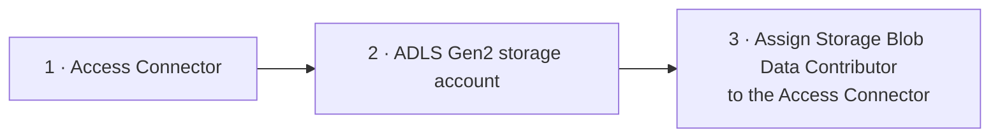

# Cloud Storage Access - Azure Setup

This lesson covers the **Azure side** of the setup (steps 1–3 from the
[concepts lesson](05_cloud-storage.md)): create an **access connector**, create an
**ADLS Gen2 storage account**, and assign the **permissions** that let the access
connector reach the storage account.

Steps 4–5 (the Databricks side) are covered in the
[next lesson](07_cloud-storage-access-databricks.md).

## Step 1 - Create the Access Connector

1. Azure portal → **Create a resource** → search **Access Connector for Azure
   Databricks** → **Create**.
2. Configure:
   - **Subscription / Resource group** - the same ones used for the course (keep all
     course resources together).
   - **Name** - e.g. `databricks-course-ext-ac` (`ext` = external rather than default
     storage, `ac` = access connector).
   - **Region** - closest to you (e.g. UK South).
3. **Tags** - optional.
4. **Managed identity** - **System-assigned** is fine here (use user-assigned only if
   you have one).
5. **Create**.

## Step 2 - Create the ADLS Gen2 storage account

1. Azure portal → **Create a resource** → search **Storage account** → **Create**.
2. Configure:
   - **Subscription / Resource group** - same as above.
   - **Name** - e.g. `databrickscourseextdl1`.

    !!! warning "Storage account name rules"
        The name must be **globally unique** across all Azure storage accounts,
        **3–24 characters**, and **alphanumeric only** (no hyphens or underscores). If
        a name is taken, append a number (e.g. `...dl1`).

   - **Region** - closest to you (UK South).
   - **Performance** - **Standard** is fine for learning.
   - **Redundancy** - **Locally redundant storage (LRS)** is enough and keeps cost
     low (no geo-redundancy needed).
3. On the **Advanced** tab, **enable Hierarchical namespace**.

    !!! info "This is what makes it a Data Lake"
        Enabling **hierarchical namespace** is what turns a regular storage account
        into an **ADLS Gen2** account. Make sure it is selected.

4. **Review + create** → **Create** → **Go to resource**.

## Step 3 - Assign the role to the Access Connector

The access connector needs permission to access the storage account. Grant it the
**Storage Blob Data Contributor** role.

1. Open the **storage account** → **Access Control (IAM)** → **Add → Add role
   assignment**.
2. Select the role **Storage Blob Data Contributor**.
3. Assign access to a **Managed identity** → select **Access connector for Azure
   Databricks** → choose the connector created in Step 1 (`databricks-course-ext-ac`).
4. **Review + assign**.

!!! note
    With this role, the access connector's managed identity can read and write blob
    data in the storage account - which the storage credential will inherit in the
    next lesson.

## What's next

The Azure side is done. Next we create the storage credential and external location in
Databricks. Continue to
[Cloud Storage Access - Databricks Setup](07_cloud-storage-access-databricks.md).

## References

- [What is Unity Catalog?](https://learn.microsoft.com/en-us/azure/databricks/data-governance/unity-catalog/)
- [Unity Catalog securable objects](https://learn.microsoft.com/en-us/azure/databricks/data-governance/unity-catalog/securable-objects)
- [Connect to cloud object storage using Unity Catalog](https://learn.microsoft.com/en-us/azure/databricks/connect/unity-catalog/)
- [Create a storage credential for Azure Data Lake Storage](https://learn.microsoft.com/en-us/azure/databricks/connect/unity-catalog/cloud-storage/storage-credentials)
