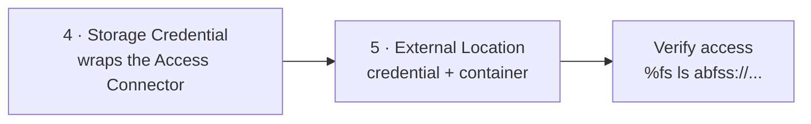
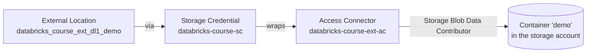

# Cloud Storage Access - Databricks Setup

With the Azure side complete, this lesson covers the **Databricks side** (steps 4–5):
create the **storage credential** and the **external location**, then verify access.



## Step 4 - Create the storage credential

You can create a storage credential via the Databricks CLI or the workspace UI. Using
the UI:

1. Sidebar → **Catalog** → open **Catalog Explorer**.
2. Click **Connect → Credentials** to see all storage credentials you can access.

    !!! note "A default credential already exists"
        Databricks creates UC-related objects by default, including a storage
        credential wrapped around the **default** Unity Catalog access connector. That
        is **not** the one we created - we want to wrap **our** access connector.

3. **Create credential**:
   - **Name** - e.g. `databricks-course-sc` (`sc` = storage credential).
   - **Access connector ID** - the **resource ID** of the access connector created in
     the [Azure setup](06_cloud-storage-access-azure.md).
   - Leave **user-assigned managed identity** blank; add an optional comment.
4. **Create**.

### Getting the Access Connector resource ID

In the Azure portal, open the access connector (search **Access Connector** if it's
not in recents). Copy the **Resource ID** from the overview, or from **Settings →
Properties → ID**. Paste it into the credential form.

!!! info "Why a storage credential at all?"
    The storage credential **wraps** the access connector, and the access connector has
    access to the storage account - so the credential inherits that access. The
    storage credential is the **Unity Catalog object** that UC understands (UC can't
    use the raw access connector directly).

## Step 5 - Create the external location

### First, create a container

When the storage account was created, no containers were added. Create one:

1. Storage account → **Data storage → Containers → + Container**.
2. Name it, e.g. `demo` → **Create**.

The external location will reference this container.

### Verify there's no access yet

Back in the workspace notebook (e.g. `Configure access to cloud storage`), try to list
the container - it should **fail**, because there's no external location yet:

```python
%fs ls abfss://demo@databrickscourseextdl1.dfs.core.windows.net/
```

!!! info "The ABFSS path format"
    Use the **`abfss://`** (or `abfs://`) protocol to access Azure storage containers:

    ```text
    abfss://<container>@<storage-account>.dfs.core.windows.net/
    ```

This returns an error like *"invalid configuration value detected for account key"* -
Databricks doesn't yet know to use an external location, and there's no access key.

### Create the external location with SQL

You can use the UI (**Catalog Explorer → Connect → External locations → Create**), but
**SQL is recommended** - a script is easy to version and redeploy across environments.

```sql
CREATE EXTERNAL LOCATION databricks_course_ext_dl1_demo
URL 'abfss://demo@databrickscourseextdl1.dfs.core.windows.net/'
WITH (STORAGE CREDENTIAL `databricks-course-sc`)
COMMENT 'Demo container on the external data lake';
```

- **Name** - make it meaningful (here, data lake name + container name) so it's clear
  which storage account/container it refers to.
- **URL** - the same `abfss://` path as above.
- **Storage credential** - the credential created in Step 4.
- **Comment** - optional but recommended.

### Verify access now works

Run the list command again:

```python
%fs ls abfss://demo@databrickscourseextdl1.dfs.core.windows.net/
```

This now succeeds. (An empty container simply returns `OK` / an empty list; otherwise
you'd see its files and folders.)

## How the layers fit together



The **external location** is what ultimately gives you access to the container - via
the **storage credential**, which wraps the **access connector**, which has the
**Storage Blob Data Contributor** role on the storage account.

!!! tip "In real projects"
    Most of this is done by an **administrator**; as a data engineer you're typically
    given access to a container and just use it. Still, understanding these layers
    helps you follow conversations about Unity Catalog objects.

## What's next

This completes the Unity Catalog section. You now have a metastore, a storage
credential, and an external location giving governed access to cloud storage - the
foundation for the project pipeline.

## References

- [What is Unity Catalog?](https://learn.microsoft.com/en-us/azure/databricks/data-governance/unity-catalog/)
- [Unity Catalog securable objects](https://learn.microsoft.com/en-us/azure/databricks/data-governance/unity-catalog/securable-objects)
- [Connect to cloud object storage using Unity Catalog](https://learn.microsoft.com/en-us/azure/databricks/connect/unity-catalog/)
- [Create a storage credential for Azure Data Lake Storage](https://learn.microsoft.com/en-us/azure/databricks/connect/unity-catalog/cloud-storage/storage-credentials)
