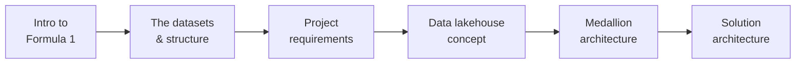

# Formula 1 Project - Section Overview

This section introduces the **Formula 1 project** we'll build throughout the rest of
the course. The goal is to establish a clear foundation before designing the solution.

## What this section covers

| Lesson | Focus |
| --- | --- |
| **[The Formula 1 Data](02_formula1-data.md)** | A brief intro to the sport for context, then the datasets and their structure. |
| **[Project Requirements](03_requirement.md)** | The functional and non-functional requirements of what we'll build. |
| **[The Data Lakehouse](04_data-lakehouse.md)** | The data lakehouse concept - combining data warehouses and data lakes. |
| **[Medallion Architecture](05_medaillion-architecture.md)** | The bronze / silver / gold data design pattern. |
| **[Solution Architecture](06_architecture-overview.md)** | The end-to-end architecture we'll implement for the project. |

This gives a clear foundation before we move on to designing and building the
solution. Let's get started.

## References

- [What is a data lakehouse?](https://learn.microsoft.com/en-us/azure/databricks/lakehouse/)
- [What is the medallion lakehouse architecture?](https://learn.microsoft.com/en-us/azure/databricks/lakehouse/medallion)
- [Delta Lake documentation](https://docs.delta.io/)
- [What are tables in Azure Databricks?](https://learn.microsoft.com/en-us/azure/databricks/tables/table-overview)
