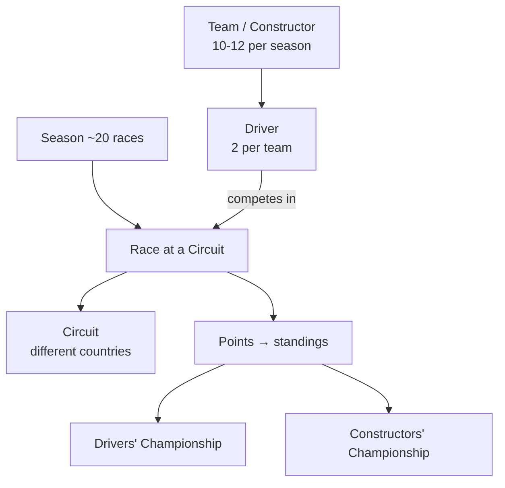
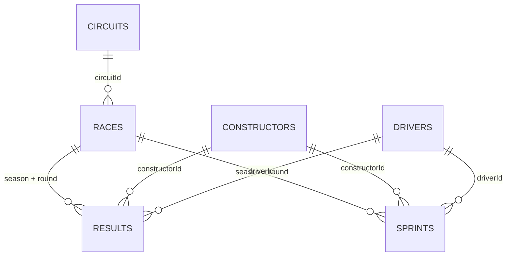

# The Formula 1 Data

This lesson introduces the data we'll use for the project. Since not everyone follows
the sport, we'll start with a brief overview of how **Formula 1** is structured, then
look at the datasets themselves.

## How Formula 1 is structured

Like the English Premier League (football) or the Indian Premier League (cricket), a
**Formula 1 season** happens once a year and consists of roughly **20 races**. Each
race takes place over a weekend (Friday–Sunday).

| Concept | Description |
| --- | --- |
| **Circuit** | Where a race takes place; circuits are in different countries and most host one race per season. |
| **Team / Constructor** | ~10–12 teams per season. Each designs its own car. |
| **Driver** | A team typically has **two** drivers, each assigned a car. Drivers compete representing their constructor. |

### A race weekend

A race weekend consists of several sessions:

| Session | Scores points? | Purpose |
| --- | --- | --- |
| **Practice** | No | Teams test their car and prepare. |
| **Qualifying** | No | Decides the **grid position** (start order) - qualifying higher is a big advantage. |
| **Race** | Yes | Drivers compete over multiple laps; points awarded by finishing position. |
| **Sprint** (recent seasons) | Yes | A shorter race on some weekends with its own qualifying; awards additional points. |

Constructors are awarded the **combined points** scored by both their drivers. These
points feed the **Drivers' Championship** and **Constructors' Championship**. At
season's end, the top driver becomes **Drivers' Champion** and the top team becomes
**Constructors' Champion**.

!!! note "Project scope"
    We focus on **core race outcomes**: seasons, circuits, constructors, drivers, race
    results, and sprint results. We do **not** model practice or detailed qualifying
    data - the goal is to analyse **race performance and points** across seasons.

## The data source

The data was downloaded from the **[jolpica-f1](https://github.com/jolpica/jolpica-f1)**
GitHub repository, an open-source API. The course uses the traditional relational
**Ergast format** (easier to understand and well suited to the project).

!!! info "Licensing & attribution"
    The repository is released under the **Apache 2.0** license, so the data can be
    used for educational purposes - provided the license terms are respected,
    including **proper attribution** to the source.

!!! tip "No API needed"
    You don't need to use the API or fetch any additional data. **All required
    datasets are provided as course resources** for download, pre-formatted for the
    project (the instructor prepared multiple formats - JSON, CSV, etc. - to make the
    learning realistic).

## The relational data model

The data has **six main tables**:

| Table | Identified by | Notes |
| --- | --- | --- |
| **circuits** | `circuitId` | Circuit name, location, country. |
| **races** | `season` + `round` (natural key) | Individual races within a season; links to a circuit via `circuitId` (foreign key). |
| **constructors** | `constructorId` | The teams participating. |
| **drivers** | `driverId` | The drivers. |
| **results** | `season` + `round` + `constructorId` + `driverId` (composite key) | Outcome per driver per race: grid position, laps, points, finishing position, etc. |
| **sprints** | `season` + `round` + `constructorId` + `driverId` (composite key) | Same shape as results, but for the **sprint** race. |

!!! note "Natural keys mirror the sport"
    Instead of an artificial race ID, the model uses the natural **season + round**
    combination. In a given season and round, a specific driver representing a
    specific constructor has exactly one result - which the composite keys capture.

## How the data is physically stored

The files use a deliberate **mix of formats** to give practice with different
ingestion patterns:

| Dataset | Format | Notes |
| --- | --- | --- |
| **circuits**, **races** | CSV | Straightforward tabular structure - simplest to ingest. |
| **constructors**, **drivers** | Single-line JSON | `drivers` also has a **nested** JSON structure. |
| **results** | Single-line JSON, **split across multiple files** | Simulates data arriving in batches. |
| **sprints** | **Multi-line** JSON, **split across multiple files** | Requires slightly different handling than single-line JSON. |

This mix of CSV, single-line JSON, and multi-line JSON (some split across files) gives
realistic practice with different file formats and ingestion patterns.

## What's next

Next we define exactly what we want to build. Continue to
[Project Requirements](03_requirement.md).

## References

- [What is a data lakehouse?](https://learn.microsoft.com/en-us/azure/databricks/lakehouse/)
- [What is the medallion lakehouse architecture?](https://learn.microsoft.com/en-us/azure/databricks/lakehouse/medallion)
- [Delta Lake documentation](https://docs.delta.io/)
- [What are tables in Azure Databricks?](https://learn.microsoft.com/en-us/azure/databricks/tables/table-overview)
