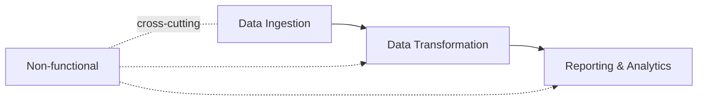
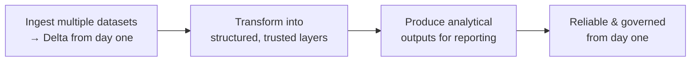

# Project Requirements

Now that we understand the data, this lesson defines what we want to build. The
requirements are grouped into four areas.

## 1. Data ingestion requirements

- Ingest all **six datasets**: circuits, races, constructors, drivers, results,
  sprints (a mix of CSV and JSON).
- Apply the **correct schema** - appropriate column names and data types.
- Add **audit columns** such as **ingestion timestamp** and **source file name** so
  data can be traced and validated.
- Store all data in **Delta format from the very beginning**.
- Maintain **data integrity and reliability** throughout.
- Start with a **full load** of the complete dataset; later enhance to support
  **incremental loads**.

## 2. Data transformation requirements

Transform ingested data into a structured, reliable data model:

- **Clean and standardize** data for consistency across all datasets.
- Apply **consistent naming conventions** and **reshape** data where needed,
  including **flattening nested structures**.
- **Remove unnecessary columns** and perform basic **data quality checks** (handle
  null key values and duplicate records).
- **Preserve business keys** (season, round, driver ID, constructor ID, etc.) so
  entity relationships are maintained.
- Prepare the data for analytical and reporting workloads in the **gold layer**.

## 3. Reporting & analytical requirements

Produce meaningful insights from the transformed data:

- **Driver standings** available for each race year.
- **Constructor standings** generated for each race year.
- Support analysis of **dominant drivers and constructors over time**.
- Allow analysis across **recent seasons** as well as **historical data**.
- Final datasets must support **efficient reporting and analytical queries**.

## 4. Non-functional requirements

| Requirement | Detail |
| --- | --- |
| **Scheduling** | Pipelines run **every Sunday at 10:00 PM**. |
| **No-data resilience** | If there's a race, process the new data; if not, the pipeline still **completes successfully** without failure. |
| **Operability** | Monitor execution, **rerun failed jobs**, and configure **alerts** on failures. |
| **GDPR** | Support **deleting individual records** (right to be forgotten) and **correcting** data when necessary. |
| **Time travel** | Query **historical versions** of the data and **roll back** tables to a previous state if issues occur. |

## Summary

We'll ingest multiple datasets (stored as Delta from the start), transform them into
structured/trusted layers, produce analytical outputs, and design the solution to be
**reliable and governed from day one**.

## What's next

With requirements defined, we design the architecture - starting with the data
lakehouse concept. Continue to [The Data Lakehouse](04_data-lakehouse.md).

## References

- [What is a data lakehouse?](https://learn.microsoft.com/en-us/azure/databricks/lakehouse/)
- [What is the medallion lakehouse architecture?](https://learn.microsoft.com/en-us/azure/databricks/lakehouse/medallion)
- [Delta Lake documentation](https://docs.delta.io/)
- [What are tables in Azure Databricks?](https://learn.microsoft.com/en-us/azure/databricks/tables/table-overview)
