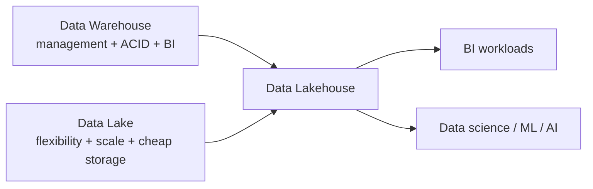

# The Data Lakehouse

Databricks enables us to build a modern **data lakehouse** platform. This lesson
explains the concept and how it evolved from data warehouses and data lakes.

## What is a data lakehouse?

The term *data lakehouse* was coined by Databricks and is now widely adopted.

!!! quote "Databricks' definition"
    A data lakehouse is a new, open data architecture that merges the **flexibility,
    cost efficiency, and scalability of data lakes** with the **data management and
    ACID transaction capabilities of data warehouses** - supporting both **BI** and
    **machine learning** workloads on a unified platform.

To appreciate why it exists, let's look at the history.

## Data warehouses (early 1980s)

Businesses needed a **centralized** place to store organizational data for
decision-making across the whole company rather than per-department silos.

- Primarily **operational** data (some also gathered external data).
- Data was **structured** (SQL tables) or **semi-structured** (JSON, XML) - but
  **not unstructured** (images, video).
- Data was loaded via **ETL** (Extract, Transform, Load).
- Complex warehouses had **data marts** (subject/region-specific), holding cleaned,
  validated, aggregated data exposed through **BI reports** (KPIs).

By the early 2000s most large companies had a data warehouse, but they had
significant challenges:

| Challenge | Detail |
| --- | --- |
| **Unstructured data** | Internet growth brought video/images/text that warehouses weren't designed for. |
| **Slow to add data** | Data loaded only after quality checks and transformation → longer development. |
| **Vendor lock-in** | Built on relational/MPP engines with proprietary formats. |
| **Hard to scale** | On-prem warehouses needed large migration projects to grow. |
| **Expensive storage** | Couldn't scale storage independently of compute. |
| **Limited DS/ML/AI** | Little support for data science, ML, and AI workloads. |

## Data lakes (~2011)

Data lakes addressed many warehouse limitations:

- Handle **structured, semi-structured, and unstructured** data (≈90% of data today
  is unstructured).
- **Raw data ingested directly** without initial cleansing/transformation → quicker
  development and faster ingestion.
- Built on **cheap storage** (HDFS, Amazon S3, Azure Data Lake Storage Gen2).
- Used **open file formats** (Parquet, ORC, Avro) → broad tooling.
- Supported **data science and ML** with access to raw and transformed data.

But data lakes were **too slow for interactive BI** and lacked governance, so
companies copied subsets into a warehouse for reporting - creating a complex
architecture with too many moving parts.

### Data lake challenges (no ACID)

Data lakes lacked **ACID** transactions (**A**tomicity, **C**onsistency,
**I**solation, **D**urability), leading to:

- Failed jobs leaving **partially loaded files** needing cleanup on reruns.
- No guarantee of **consistent reads** (users could read partially written data).
- **No support for updates** - correcting data meant rewriting entire partitions.
- **No rollback** to recover from failures.
- **GDPR deletions** sometimes required rewriting entire files.
- **No version control** → harder to track changes, roll back, or govern.
- Poor **interactive query performance** and weak security/governance.
- Complex setup, and **separate** streaming/batch processing (complex Lambda
  architectures).

## How the lakehouse combines both

| | Data Warehouse | Data Lake | Data Lakehouse |
| --- | --- | --- | --- |
| **BI workloads** | ✅ | ❌ | ✅ |
| **DS / ML / AI** | ❌ | ✅ | ✅ |
| **All data types** | ❌ | ✅ | ✅ |
| **ACID transactions** | ✅ | ❌ | ✅ |
| **Cheap object storage** | ❌ | ✅ | ✅ |

A data lakehouse is essentially a **data lake with built-in ACID transactions and
governance**, achieved with:

- **Delta Lake** - the file format providing ACID support.
- **Unity Catalog** - the data governance solution.

With ACID support, streaming and batch workloads combine seamlessly (no Lambda
architecture), the data serves DS/ML directly, and it integrates with BI tools (Power
BI, Tableau) with role-based access control - **eliminating the need to copy data into
a separate warehouse**.

## Benefits summary

- Handles **all data types** (structured, semi-structured, unstructured).
- Runs on **cost-effective cloud object storage** with open formats (Delta Lake).
- Supports a **wide range of workloads** (BI, DS, ML).
- **Direct BI integration** - no data duplication into a warehouse.
- **ACID support, versioning, and history** → prevents unreliable "data swamps".
- **Better performance** than traditional data lakes.
- **Simpler architecture** - no Lambda architecture, less reliance on separate
  warehouses.

## What's next

Next we look at the data design pattern used inside the lakehouse. Continue to
[Medallion Architecture](05_medaillion-architecture.md).

## References

- [What is a data lakehouse?](https://learn.microsoft.com/en-us/azure/databricks/lakehouse/)
- [What is the medallion lakehouse architecture?](https://learn.microsoft.com/en-us/azure/databricks/lakehouse/medallion)
- [Delta Lake documentation](https://docs.delta.io/)
- [What are tables in Azure Databricks?](https://learn.microsoft.com/en-us/azure/databricks/tables/table-overview)
