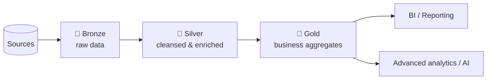

# Medallion Architecture

The data architecture used inside a data lakehouse is commonly called the **Medallion
Architecture** - a term coined by Databricks and now widely adopted.

!!! note "A data design pattern, not an architectural pattern"
    The Medallion Architecture is a **data design pattern**. The pattern has existed in
    data warehouses and data lakes for some time; Databricks refined it within the
    lakehouse model using a simple three-layer structure: **bronze, silver, gold** -
    which is where the name "medallion" comes from.

## The layers

As data flows through the layers, its **quality improves**.

!!! info "Three layers is common, not mandatory"
    Some projects add a fourth **platinum** layer; simpler projects may use only two.
    You can have as many layers as you like - the key is to **clearly define each
    layer's characteristics upfront** to get maximum benefit.

### Bronze layer

- Contains **raw data** as received from the various sources.
- **Minimal to no transformation** - at most, metadata such as a **load timestamp**
  or **file name** is added for tracking.
- Crucial for **auditing** and identifying data issues.
- Keeping data untransformed maintains a **historical record**, making it easy to
  **replay** if pipeline issues occur later.
- Supports **fast ingestion** of high-volume, high-velocity data.

### Silver layer

- Holds **filtered, cleansed, and enriched** data, with structure applied and schema
  **enforced or evolved** for consistency.
- Data quality checks: invalid records removed, column values standardized,
  duplicates eliminated, missing values replaced or removed.
- Required context/descriptions added.
- Result: **structured, high-quality, reliable** data - suitable for data science,
  ML, and AI workloads.

### Gold layer

- Contains **business-level aggregated** data.
- Silver data is further aggregated and enriched for **high-level business reporting
  and analysis**, plus advanced analytics and AI where needed.

## Benefits of the Medallion Architecture

| Benefit | How it helps |
| --- | --- |
| **Lineage & traceability** | Clearly defined layers make it easier to track where data came from and how it was transformed. |
| **Governance & compliance** | Each layer has a defined meaning/granularity, helping define policies (GDPR, CCPA, retention). |
| **Incremental processing** | Process only new/changed data → lower compute cost and better performance. |
| **Workload management** | Better management per layer → scalable solutions. |
| **Security** | Role-based access control per layer - e.g. grant gold-only access to users who shouldn't see transactional data in bronze/silver. |

## Summary

The Medallion Architecture is a **flexible data design pattern** that adapts to your
project. By clearly defining each layer's purpose and characteristics, you ensure data
**consistency, quality, and efficiency** throughout the pipeline.

## What's next

Next we apply these concepts to the actual Formula 1 solution. Continue to
[Solution Architecture](06_architecture-overview.md).

## References

- [What is a data lakehouse?](https://learn.microsoft.com/en-us/azure/databricks/lakehouse/)
- [What is the medallion lakehouse architecture?](https://learn.microsoft.com/en-us/azure/databricks/lakehouse/medallion)
- [Delta Lake documentation](https://docs.delta.io/)
- [What are tables in Azure Databricks?](https://learn.microsoft.com/en-us/azure/databricks/tables/table-overview)
