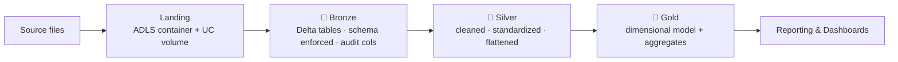
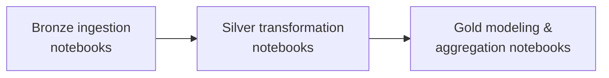
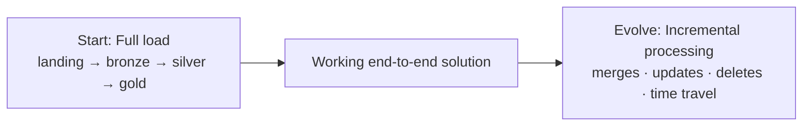

# Solution Architecture

With the data lakehouse and Medallion concepts understood, this lesson describes the
**solution architecture** we'll implement for the Formula 1 project.

## Medallion is a flexible pattern

!!! note "Guiding principles, not rigid rules"
    The Medallion Architecture is **not a rigid pattern** - it provides guiding
    principles. The core idea is that **data quality improves** as it moves through
    clearly defined layers. Projects adapt it: some add a **landing** layer upfront;
    others add **platinum**, **sandbox**, or **feature** layers (for ML); large
    enterprises may have five or six layers. As long as each layer has a clearly
    defined purpose, it belongs in your architecture.

## Our four layers

For this project we add a **landing** layer as the entry point, followed by **bronze**,
**silver**, and **gold**.

### Landing layer

- Where source files are stored **before any processing**.
- Implemented as a **container in Azure Data Lake Storage**, referenced from
  Databricks via a **Unity Catalog volume**.
- **No transformation** happens here - it's a controlled place to land files before
  ingestion.

!!! info "Manual upload vs real projects"
    In this course we upload the files **manually** to focus on building the lakehouse
    solution inside Databricks. In real projects the files would usually arrive via an
    automated ingestion tool (e.g. **Azure Data Factory** or **Fivetran**) - but the
    architecture inside the lakehouse stays the same.

### Bronze layer

- Delta tables that **closely reflect** the structure of the source files.
- Read source files from the **landing volume**, apply **schema enforcement** (control
  columns and data types), add **metadata columns** (ingestion timestamp, source file
  name), and write output in **Delta** format in the **bronze** schema.
- Not about perfecting data - it's the **auditable record** of what was received.

### Silver layer

Shape the data into a cleaner, consistent structure:

- **Standardize and reshape** as required.
- Apply **consistent naming conventions** (predictable column names).
- Apply **basic data quality rules** (remove null primary keys, remove duplicates).
- **Flatten nested structures** for easier analysis.

Output: **trusted, consistent datasets** ready for gold. Bronze retains full
traceability; silver is the cleaner layer used for downstream modeling.

### Gold layer

- Build **business-level aggregates** as a **dimensional data model** (dimensions and
  fact tables).
- **Dimensions:** drivers, constructors, races.
- **Fact tables:** race results, sprint results, etc.
- **Aggregated outputs:** driver standings, constructor standings.
- Optimized for **reporting and dashboards**.

## Orchestration with Databricks Jobs

The whole workflow runs end-to-end via **Databricks Jobs**, with task execution
mapping directly to the four layers:

Jobs provide the operational features we need - **task dependencies, retries,
monitoring, and alerting** - keeping orchestration inside Databricks and the
architecture clean.

## Full load first, then incremental

We start with a **full load** to build a working end-to-end solution, then extend to
**incremental processing** later. The **Delta** format makes this easier with reliable
**merges, updates, deletes, and version history** - so we start simple, make it work
end-to-end, then evolve it using production patterns.

## Summary

This is the solution architecture for the Formula 1 project: a **landing → bronze →
silver → gold** flow following Medallion principles inside a modern data lakehouse,
orchestrated by Databricks Jobs.

## What's next

The next section begins implementing this architecture step by step, starting with the
environment setup in Unity Catalog.

## References

- [What is a data lakehouse?](https://learn.microsoft.com/en-us/azure/databricks/lakehouse/)
- [What is the medallion lakehouse architecture?](https://learn.microsoft.com/en-us/azure/databricks/lakehouse/medallion)
- [Delta Lake documentation](https://docs.delta.io/)
- [What are tables in Azure Databricks?](https://learn.microsoft.com/en-us/azure/databricks/tables/table-overview)
