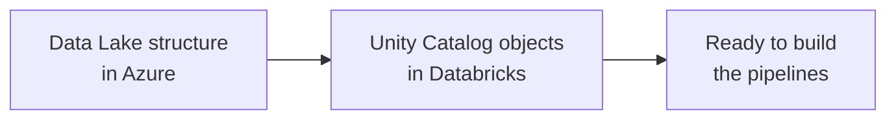

# Project Setup - Section Overview

This section sets up the environment required for the Formula 1 project, so everything
is ready to start building the pipelines.

## What this section covers

| Lesson | Focus |
| --- | --- |
| **[Data Lake Environment](02_data-lake-project-environment.md)** | Set up the Data Lake structure in Azure to store our data, and create the external location. |
| **[Unity Catalog Environment](03_unity-catalog-project-environment.md)** | Configure the Unity Catalog objects (catalog, schemas, volume) to manage and organize the data within Databricks. |

By the end of this section you'll have everything ready to start building the
pipelines. Let's get started.

## References

- [Connect to cloud object storage using Unity Catalog](https://learn.microsoft.com/en-us/azure/databricks/connect/unity-catalog/)
- [Create a storage credential for Azure Data Lake Storage](https://learn.microsoft.com/en-us/azure/databricks/connect/unity-catalog/cloud-storage/storage-credentials)
- [What are Unity Catalog volumes?](https://learn.microsoft.com/en-us/azure/databricks/volumes/)
- [Unity Catalog managed tables](https://learn.microsoft.com/en-us/azure/databricks/tables/managed)
