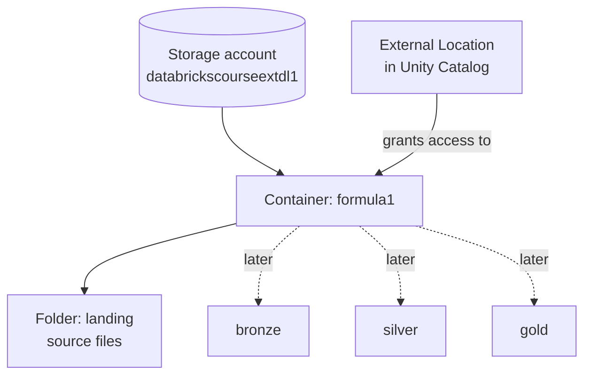

# Data Lake Environment

Our solution follows the **Medallion architecture** - ingest source data into
**bronze**, refine in **silver**, and create business-level datasets in **gold**, with
a **landing** layer as the entry point. This lesson translates that architecture into
the **Azure Data Lake** containers and the **external location** we need.

## What we're setting up

All source files arrive as files, so they live in the Azure Data Lake Storage account
created earlier (`databrickscourseextdl1`). Within it we create a **`formula1`**
container, organized by data layer, starting with a **`landing`** sub-folder.



The data flows: **landing → bronze → silver → gold**, progressively refined. We then
create an **external location** in the Unity Catalog metastore so the Databricks
workspace can access the `formula1` container and its data.

## Step 1 - Create the container and folder (Azure portal)

1. Open the **storage account** (`databrickscourseextdl1`).
2. **Containers** (under Data storage) - or the **Storage browser** - → **+ Container**
   → name it **`formula1`** → create.
3. Open the `formula1` container → **Add Directory** → name it **`landing`** → save.

## Step 2 - Upload the source files

The data is provided as a course resource (`landing.zip`). Unzipping it produces a
`landing` folder with the six datasets:

| Dataset | Files |
| --- | --- |
| **circuits**, **constructors**, **drivers**, **races** | One file each - all data from the start of Formula 1 up to the 2025 season. |
| **results** | **One file per season** (1950 → 2025), kept in a folder. |
| **sprints** | **One file per season** (sprints were introduced in **2021**, so data starts from 2021). |

1. Inside the `landing` folder (under `formula1`), click **Upload**.
2. Drag and drop the files and click **Upload** - this uploads **85 files** (many of
   them are the per-season files in `results` and `sprints`).

!!! tip "Stay in the right place"
    Make sure you are inside the **`landing`** folder (under `formula1`) before
    uploading.

## Step 3 - Create the external location (Databricks)

As before, we create the external location **programmatically with SQL** in a
notebook, so it's easy to version and redeploy.

### Organise the notebooks

In **Workspace → home → databricks-course**, create a new folder
`formula1-project`, and inside it a sub-folder `01-setup` to hold the setup notebooks.
Create a new notebook there with **SQL** as the default language.

!!! tip "Copy code between notebooks with tabs"
    Besides cloning a notebook, you can enable the **Tabs** option to open two
    notebooks side by side and copy code across - e.g. reuse the external-location SQL
    from the earlier `Configure Access to Cloud Storage` notebook.

### Verify there's no access yet

Attach the notebook to the **Databricks Course Cluster** and try to list the container
- it errors because no external location exists yet:

```python
%fs ls abfss://formula1@databrickscourseextdl1.dfs.core.windows.net/
```

### Create the external location

```sql
CREATE EXTERNAL LOCATION databricks_course_ext_dl1_formula1
URL 'abfss://formula1@databrickscourseextdl1.dfs.core.windows.net/'
WITH (STORAGE CREDENTIAL `databricks-course-sc`)
COMMENT 'Formula 1 container on the external data lake';
```

This reuses the **storage credential** created in the Unity Catalog section (only the
container name changes from `demo` to `formula1`).

### Verify access now works

Check **Catalog Explorer → Connect → External locations** to see the new
`databricks_course_ext_dl1_formula1` location, then list the files:

```python
%fs ls abfss://formula1@databrickscourseextdl1.dfs.core.windows.net/landing/
```

This now lists the six datasets just uploaded - confirming the workspace can access
the landing folder.

## What's next

With the data lake and external location ready, the next lesson creates the Unity
Catalog objects. Continue to
[Unity Catalog Environment](03_unity-catalog-project-environment.md).

## References

- [Connect to cloud object storage using Unity Catalog](https://learn.microsoft.com/en-us/azure/databricks/connect/unity-catalog/)
- [Create a storage credential for Azure Data Lake Storage](https://learn.microsoft.com/en-us/azure/databricks/connect/unity-catalog/cloud-storage/storage-credentials)
- [What are Unity Catalog volumes?](https://learn.microsoft.com/en-us/azure/databricks/volumes/)
- [Unity Catalog managed tables](https://learn.microsoft.com/en-us/azure/databricks/tables/managed)
