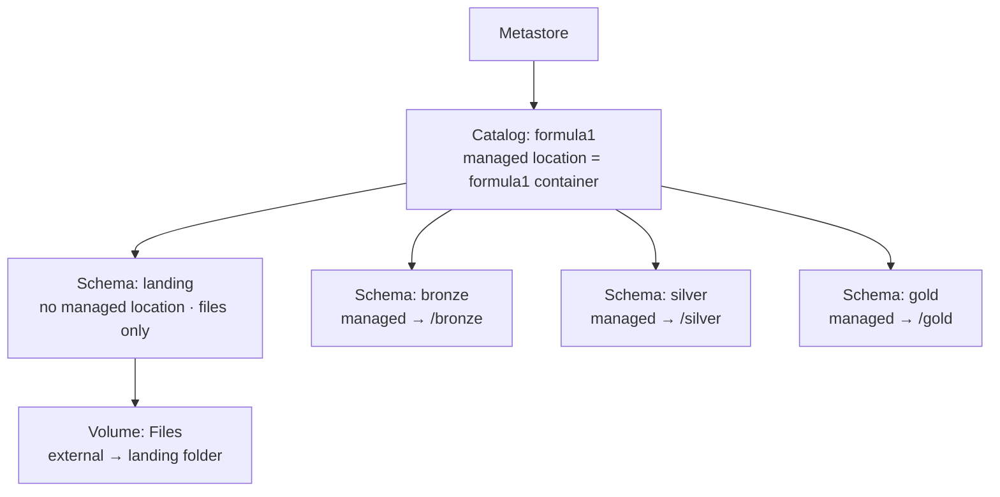
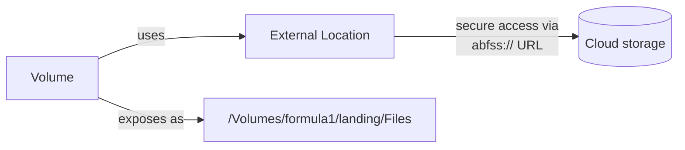

# Unity Catalog Environment

With the containers and external location in place, this lesson creates the remaining
**Unity Catalog objects** for the project: a **catalog**, four **schemas**, and a
**volume**.

## What we're creating



| Object | Name | Purpose |
| --- | --- | --- |
| **Catalog** | `formula1` | Top-level container for the project. |
| **Schemas** | `landing`, `bronze`, `silver`, `gold` | One per Medallion layer. |
| **Volume** | `Files` | References the landing folder so files are accessible as a managed path. |

Tables in bronze/silver/gold are created later as part of the ETL process. We continue
using the **setup notebook** from the previous lesson.

## Viewing existing catalogs

You can inspect catalogs via the **UI** (sidebar → **Catalog**) or with SQL:

```sql
SHOW CATALOGS;
```

You may see catalogs you didn't create:

| Catalog | What it is |
| --- | --- |
| **`databricks_course_ws`** | A **default catalog** Databricks creates per workspace (for subscriptions created from **November 2023**). Older subscriptions won't have it - that's fine. |
| **`system`** | Databricks-managed; holds platform metadata (audit logs, lineage, usage) for monitoring/governance - not for your business data. |
| **`samples`** | Shared by Databricks; sample data for demos/pet projects. |

## Step 1 - Create the catalog

Because the metastore has **no default storage**, the catalog needs a **managed
location** - we use the `formula1` container.

```sql
CREATE CATALOG IF NOT EXISTS formula1
MANAGED LOCATION 'abfss://formula1@databrickscourseextdl1.dfs.core.windows.net/'
COMMENT 'Formula 1 project catalog';
```

Verify with `SHOW CATALOGS;` - `formula1` now appears.

!!! info "Managed location & sub-folders"
    The catalog's managed location is the `formula1` container. The schema-level
    managed locations will be **sub-folders** (`bronze`, `silver`, `gold`) within it,
    so each schema's managed tables land in its own folder.

## Step 2 - Create the schemas

Use the two-level namespace `catalog.schema`. The **landing** schema holds only files
(no tables), so it gets **no managed location**; **bronze/silver/gold** each get a
managed location.

```sql
-- Landing: files only, no managed location
CREATE SCHEMA IF NOT EXISTS formula1.landing;

-- Bronze / Silver / Gold: managed locations for tables
CREATE SCHEMA IF NOT EXISTS formula1.bronze
MANAGED LOCATION 'abfss://formula1@databrickscourseextdl1.dfs.core.windows.net/bronze';

CREATE SCHEMA IF NOT EXISTS formula1.silver
MANAGED LOCATION 'abfss://formula1@databrickscourseextdl1.dfs.core.windows.net/silver';

CREATE SCHEMA IF NOT EXISTS formula1.gold
MANAGED LOCATION 'abfss://formula1@databrickscourseextdl1.dfs.core.windows.net/gold';
```

!!! note "Schema = database"
    `CREATE DATABASE` also works, but Databricks recommends **`CREATE SCHEMA`**. You
    can also create the `bronze`, `silver`, `gold` sub-folders in the storage account
    to see them clearly.

### Viewing schemas

`SHOW SCHEMAS` only lists schemas in the **current catalog**. Switch the current
catalog first:

```sql
SELECT current_catalog();        -- likely databricks_course_ws
USE CATALOG formula1;
SELECT current_catalog();        -- now formula1
SHOW SCHEMAS;                     -- landing, bronze, silver, gold (+ default, information_schema)
```

In **Catalog Explorer**, the `formula1` catalog now shows the four schemas, plus two
Databricks-managed ones:

- **`information_schema`** - platform information, managed by Databricks.
- **`default`** - created for convenience; **avoid using it** - use the properly named
  schemas instead.

## Step 3 - Create the volume

We want an **external volume** (pointing at the existing external location / landing
folder), not a managed one. Use the three-level namespace `catalog.schema.volume`.

```sql
CREATE EXTERNAL VOLUME formula1.landing.Files
LOCATION 'abfss://formula1@databrickscourseextdl1.dfs.core.windows.net/landing';
```

After creation, **Catalog Explorer** shows the `Files` volume under the `landing`
schema.

### External location vs volume - why both?



- An **external location** gives **secure access** to a cloud storage path, but you
  still reference it via the `abfss://` URL.
- A **volume** uses that external location to expose the storage as a **managed folder**
  inside Databricks, accessible via a simple path:

```python
%fs ls /Volumes/formula1/landing/Files
```

!!! warning "Capital V in /Volumes"
    The `V` in `/Volumes` must be **uppercase**. A lowercase `v` won't resolve the
    path correctly.

Volumes add extra capabilities on top of an external location - they appear in Catalog
Explorer, support **permission management**, and offer an **Upload to this volume**
button.

## Summary

We created the `formula1` **catalog**, the `landing`/`bronze`/`silver`/`gold`
**schemas**, and the `Files` **volume** - completing the project environment setup.
The next section begins building the pipeline, starting with bronze ingestion.

## References

- [Connect to cloud object storage using Unity Catalog](https://learn.microsoft.com/en-us/azure/databricks/connect/unity-catalog/)
- [Create a storage credential for Azure Data Lake Storage](https://learn.microsoft.com/en-us/azure/databricks/connect/unity-catalog/cloud-storage/storage-credentials)
- [What are Unity Catalog volumes?](https://learn.microsoft.com/en-us/azure/databricks/volumes/)
- [Unity Catalog managed tables](https://learn.microsoft.com/en-us/azure/databricks/tables/managed)
