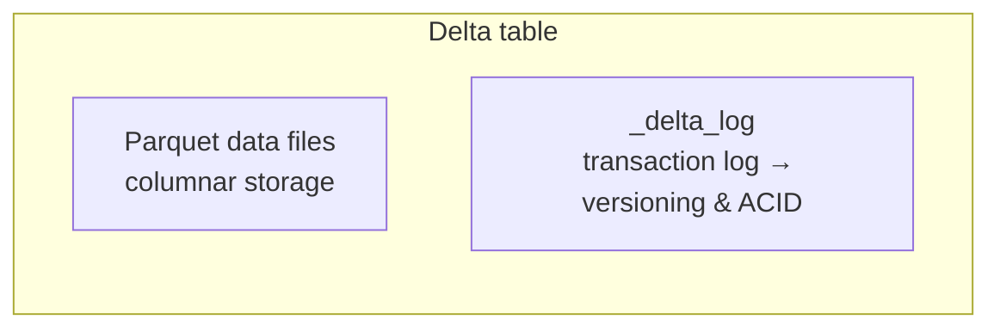

# Introduction to Delta Lake

Throughout the project we've been writing tables using the **Delta** format (you've
seen `format("delta")` in the ingestion notebooks). This lesson explains what **Delta
Lake** actually is and why it's central to the data lakehouse architecture.

## A bit of history: the limits of Parquet

Before Delta Lake, data lakes stored data in binary file formats such as **Avro, ORC,
and Parquet** - Parquet being the default in Databricks. Parquet is a highly efficient
**columnar** format, great for storing and querying large datasets.

But Parquet **by itself** offers no transactional guarantees or version control, which
leads to real-world problems:

| Problem | Consequence |
| --- | --- |
| Job fails halfway through a write | Table left in an **inconsistent state**. |
| Two jobs write the same table at once | They can **overwrite** each other's changes. |
| Reading during a write | Readers may see **partially written** data. |
| No version history / rollback | Can't recover a previous state. |
| Parquet files are **immutable** | Updates/deletes require **rewriting large portions** of data. |

In short, traditional data lakes were **efficient but not reliable**.

## What Delta Lake is

!!! abstract "Delta Lake in one sentence"
    Delta Lake is an optimized **storage layer built on top of Parquet** - it doesn't
    replace Parquet, it **extends** it by adding a **transaction log** alongside the
    Parquet data files.

So a **Delta table = Parquet data files + a transaction log**. The transaction log
tracks every change, handling versioning and transaction control, while the data
itself stays in Parquet.

!!! info "Open source"
    Delta Lake was originally developed by Databricks but is now **open source** - the
    format is not proprietary, can be used beyond Databricks, and integrates with a
    wide range of tools and platforms.

## What it provides

Via the transaction log and the Delta execution engine, Delta Lake provides:

### ACID transactions

**ACID** = Atomicity, Consistency, Isolation, Durability. In practice this means:

- A write **either fully completes or fully fails** - no partial state.
- Multiple users/jobs can write to the same table **without corrupting** it.
- Readers always see a **consistent** version of the data.
- Once committed, a write is **durable** and won't disappear.

### Versioning & time travel

Every write creates a **new version**, so Delta keeps a full history of changes. You
can view previous versions, query historical snapshots, and **roll back** if something
goes wrong - known as **time travel**. This is valuable for debugging, auditing, and
compliance.

### Data modification (DML)

Unlike traditional data lakes, Delta Lake supports **INSERT, UPDATE, DELETE, and
MERGE** - critical for incremental loads, correcting bad data, and slowly changing
dimensions. Without Delta, these would require complex, inefficient file rewrites.

## Summary

Delta Lake is an optimized storage layer on top of Parquet that adds a transaction log
enabling **reliable writes, consistent reads, version history, and DML operations**.
Every table in this course is built on Delta Lake.

## What's next

Next we go under the hood to examine the transaction log. Continue to
[The Transaction Log](02_delta-transaction-log.md).

## References

- [Delta Lake documentation](https://docs.delta.io/)
- [Delta Lake transactions](https://delta-io.github.io/delta-rs/how-delta-lake-works/delta-lake-acid-transactions/)
- [Work with Delta Lake table history](https://learn.microsoft.com/en-us/azure/databricks/delta/history)
- [RESTORE command](https://learn.microsoft.com/en-us/azure/databricks/sql/language-manual/delta-restore)
