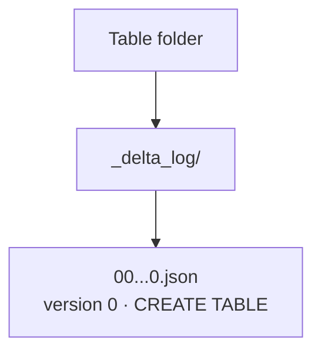
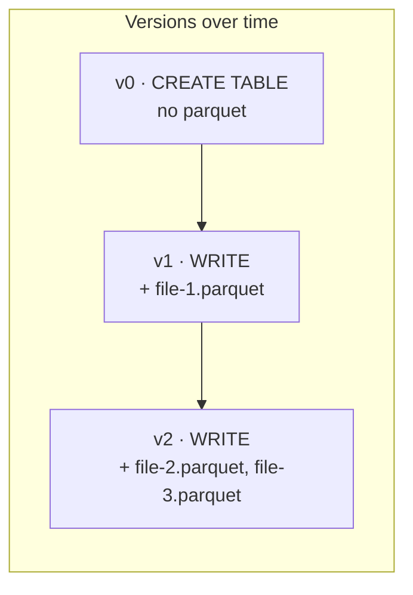

# The Transaction Log

This lesson goes deeper into how Delta tables are physically stored in cloud storage -
specifically, how the **transaction log** works. The transaction log is the key
component that enables ACID transactions, reliable writes, version history, and time
travel.

## What happens when you create a table

When you create an (empty) Delta table, two things happen:

1. Databricks registers the table **metadata in Unity Catalog**.
2. It creates a **folder in cloud storage** for the data files and transaction log.

Even with no data inserted, Delta creates a transaction log entry. Inside the table
folder is a **`_delta_log`** folder containing a JSON file for **version 0**, whose
operation is recorded as **`CREATE TABLE`**.



So Delta starts tracking history from the very beginning.

## What happens on each write

Each write produces new Parquet data file(s) **and** a new transaction log entry with
a version number. The log file records an **`add`** action for each new Parquet file.



| Version | Operation | Result |
| --- | --- | --- |
| **0** | CREATE TABLE | `_delta_log/0.json`, no Parquet files |
| **1** | WRITE (small insert) | one Parquet file + `1.json` with an `add` action |
| **2** | WRITE (larger insert) | two more Parquet files + `2.json` with `add` actions |

## How time travel works

- **Normal query:** Delta reads the **latest** version in `_delta_log`, determines
  which Parquet files are currently active, and combines them for the current state.
- **Time travel (e.g. version 1):** Delta reads the log entries **up to version 1**
  (versions 0 and 1) and **ignores** everything after, reconstructing the table
  exactly as it existed at that point.

## How ACID transactions work (in brief)

Every transaction is recorded **atomically** in the transaction log - a write either
fully succeeds or fully fails, with no in-between. Readers only see **completed**
versions, never partial data. Even with concurrent writers, the log controls which
versions are committed and visible, so the table is never corrupted. (Covered in
detail in [Support for ACID Transactions](04_support-acid-transactions.md).)

## Hands-on: inspecting the directory structure

To make it easy to explore, the demo uses a separate **`demo`** catalog and
**`delta_lake`** schema (pointing at the `demo` container and its external location),
in a notebook under an `introduction-to-delta-lake` folder.

### Create the demo catalog and schema

```sql
CREATE CATALOG IF NOT EXISTS demo
MANAGED LOCATION 'abfss://demo@databrickscourseextdl1.dfs.core.windows.net/';

CREATE SCHEMA IF NOT EXISTS demo.delta_lake
MANAGED LOCATION 'abfss://demo@databrickscourseextdl1.dfs.core.windows.net/delta_lake';
```

### Create a Delta table

```sql
CREATE TABLE demo.delta_lake.companies (
    company_name STRING,
    founded_date DATE,
    country STRING
) USING DELTA;
```

!!! note "`USING DELTA` is optional"
    Delta is the **default** format, so `USING DELTA` is optional - it's shown here to
    be explicit.

### Find where the data lives

```sql
DESCRIBE EXTENDED demo.delta_lake.companies;
```

This shows the table **type** (`MANAGED`) and the **location** in cloud storage. The
path nests under the schema's managed location: `.../delta_lake/__unitystorage/schemas/<schema-guid>/tables/<table-guid>/`. Databricks assigns a **GUID** to each schema and
table, so this is how you locate a specific table's data and logs.

### Watch the log grow

| Action | In the storage account |
| --- | --- |
| After `CREATE TABLE` | `_delta_log/` with `0.json` (operation `CREATE TABLE`), **no** Parquet files yet |
| `INSERT` 1 record | one **Parquet file** appears; `_delta_log/1.json` with an **`add`** action (operation `WRITE`) |
| `INSERT` 3 more records | another **Parquet file**; `_delta_log/2.json` with another `add` action |

```sql
INSERT INTO demo.delta_lake.companies VALUES ('Acme', DATE'1990-01-01', 'UK');
SELECT * FROM demo.delta_lake.companies;
```

## Summary

Every Delta table consists of **Parquet files** plus **transaction log files** in
`_delta_log`. Each transaction creates new Parquet file(s) and a new JSON log with a
new version number. This versioning mechanism is what gives Delta **ACID transactions,
consistent reads, reliable concurrent writes, and time travel** - making the lakehouse
production-ready with database-like capabilities.

## What's next

Next we use this versioning directly with time travel queries. Continue to
[Version History & Time Travel](03_delta-lake-version-history.md).

## References

- [Delta Lake documentation](https://docs.delta.io/)
- [Delta Lake transactions](https://delta-io.github.io/delta-rs/how-delta-lake-works/delta-lake-acid-transactions/)
- [Work with Delta Lake table history](https://learn.microsoft.com/en-us/azure/databricks/delta/history)
- [RESTORE command](https://learn.microsoft.com/en-us/azure/databricks/sql/language-manual/delta-restore)
