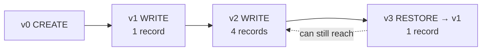

# Version History & Time Travel

This lesson covers querying a Delta table's **history** from the notebook, **time
travelling** within that history, and **restoring** a table to a previous version.

The `companies` table from the previous lesson has three transactions, so it has
history to work with.

## Viewing table history

Instead of navigating to cloud storage, view history directly with `DESCRIBE HISTORY`:

```sql
DESCRIBE HISTORY demo.delta_lake.companies;
```

This returns the full history - including the **user**, the **timestamp**, the
**version number**, and the **operation** performed:

| Version | Operation |
| --- | --- |
| 0 | CREATE TABLE |
| 1 | WRITE |
| 2 | WRITE |

## Time travel by version

Add a `VERSION AS OF` clause to query a specific version:

```sql
-- Data as it was at version 1 (one record)
SELECT * FROM demo.delta_lake.companies VERSION AS OF 1;

-- Without the clause → latest version (four records)
SELECT * FROM demo.delta_lake.companies;
```

## Time travel by timestamp

You can also query by point in time with `TIMESTAMP AS OF`:

```sql
SELECT * FROM demo.delta_lake.companies
TIMESTAMP AS OF '2026-02-01 10:30:00';
```

!!! tip "Timestamp format"
    Use a standard format - `YYYY-MM-DD`, or with time `YYYY-MM-DD HH:MM:SS`. You can
    grab the exact timestamp for a version from the `DESCRIBE HISTORY` output.

This is especially useful for **data quality issues** - e.g. if an external supplier
says the data from a certain version was correct and you need to go back to it.

## Restoring a previous version

Beyond querying, Delta Lake can **restore** the table to a previous version or
timestamp with `RESTORE TABLE`:

```sql
RESTORE TABLE demo.delta_lake.companies TO VERSION AS OF 1;

SELECT * FROM demo.delta_lake.companies;   -- now one record again
```

Checking history again shows a **new version** with a **`RESTORE`** operation -
restore doesn't erase later versions, so you can still go back to version 2 if needed.



## Why restore is so efficient

Looking at the `_delta_log` for the restore (version 3): it simply records a
**`remove`** action for one Parquet file - it does **not** rewrite any data. The table
folder still has both Parquet files; the latest version just **excludes** the one from
version 2.

!!! tip "Metadata, not data, rewrites"
    Imagine millions of records: rewriting Parquet files would take a long time.
    Instead Delta updates the **log file** to exclude/include files, applying the
    change in **seconds**. This is why the Delta engine is far more efficient and
    performant than the standard Spark engine for rollbacks, deletes, and updates.

## Summary

`DESCRIBE HISTORY` exposes the version history; `VERSION AS OF` / `TIMESTAMP AS OF`
let you time travel; and `RESTORE TABLE` rolls back efficiently by manipulating the
transaction log rather than rewriting data.

## What's next

Next we look in detail at how the transaction log delivers ACID guarantees. Continue to
[Support for ACID Transactions](04_support-acid-transactions.md).

## References

- [Delta Lake documentation](https://docs.delta.io/)
- [Delta Lake transactions](https://delta-io.github.io/delta-rs/how-delta-lake-works/delta-lake-acid-transactions/)
- [Work with Delta Lake table history](https://learn.microsoft.com/en-us/azure/databricks/delta/history)
- [RESTORE command](https://learn.microsoft.com/en-us/azure/databricks/sql/language-manual/delta-restore)
