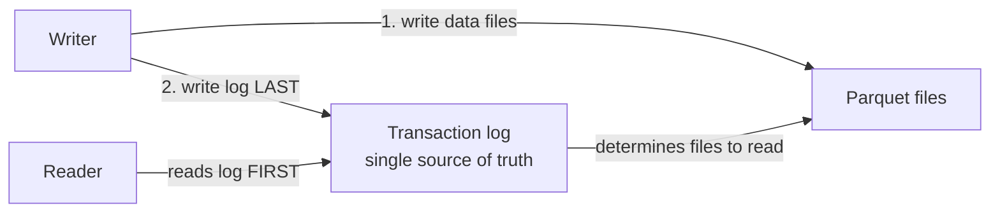
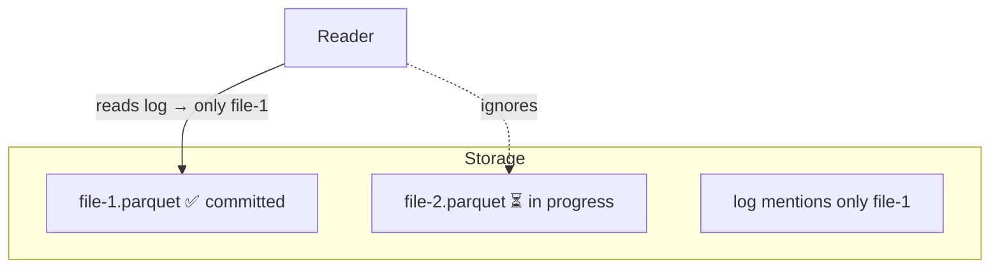
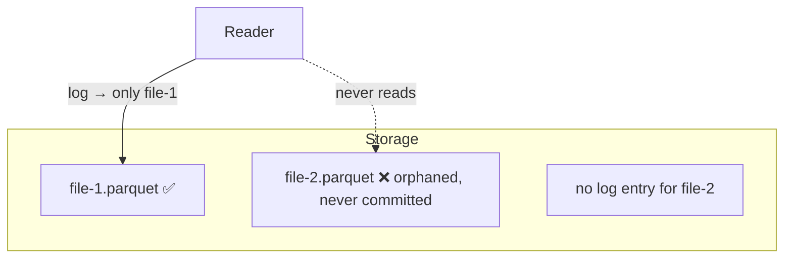

# Support for ACID Transactions

Now that we're familiar with transaction logs, this lesson shows **how they provide
ACID transactions** - focusing on **consistent reads** and **process isolation**,
which are fundamental to ACID.

## Two key factors

1. **The transaction log is written only at the *end* of a transaction.** Data files
   are written first; only after they complete successfully is the log written. This
   makes the log the **single source of truth**.
2. **Every reader reads the transaction log first**, then determines which data files
   to read - again treating the log as the single source of truth.

## Scenario 1 - Consistent reads during a concurrent write

Start with a table where transaction 1 created the table and transaction 2 added
`file-1.parquet`. Now a **writer** is inserting more data: it has written
`file-2.parquet` but **hasn't written the transaction log yet**.

A reader querying now starts from the log, which **only mentions `file-1.parquet`**, so
it reads just that file - it does **not** see the partially written `file-2.parquet`.
This guarantees **consistent reads**, even with concurrent processes.

Once the writer finishes all data files, it writes the transaction log last. A
subsequent read sees **both** Parquet files, returning the complete data.

## Scenario 2 - A failed write

It's common for a write to fail mid-transaction (hardware failures, programming
errors, data issues). Using the same starting table, a writer writes `file-2.parquet`
and then **fails**.

Because the **transaction log is written last**, it is **never written** for the failed
write. Readers always start from the log, which has no reference to the partially
written file - so they read only `file-1.parquet` and stay consistent.

When you fix the issue and rerun, the new writer **doesn't touch** the orphaned file -
it writes a **new** file and, on success, writes the log entry for it. Readers then see
`file-1` plus the new file, never the corrupt one.

## How this delivers ACID

| Mechanism | ACID property |
| --- | --- |
| Log written atomically at the end | **Atomicity** - write fully succeeds or fully fails |
| Readers only see committed log versions | **Consistency** / **Isolation** - no partial reads |
| Concurrent writers coordinated via the log | **Isolation** - no corruption |
| Committed versions persist in the log | **Durability** |

## Summary

Delta Lake uses the **transaction log** - written last and read first - to allow
multiple concurrent transactions while always providing **consistent data**. This is
how Delta Lake provides **ACID transactions**.

## What's next

This concludes the Delta Lake section. Next we'll apply these capabilities as we build
out the project pipeline.

## References

- [Delta Lake documentation](https://docs.delta.io/)
- [Delta Lake transactions](https://delta-io.github.io/delta-rs/how-delta-lake-works/delta-lake-acid-transactions/)
- [Work with Delta Lake table history](https://learn.microsoft.com/en-us/azure/databricks/delta/history)
- [RESTORE command](https://learn.microsoft.com/en-us/azure/databricks/sql/language-manual/delta-restore)
