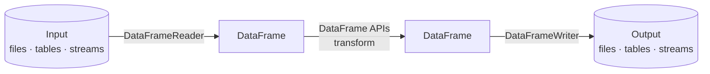
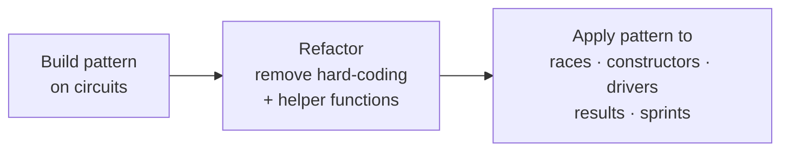

# Data Ingestion (Bronze) - Section Overview

In this section we ingest all the Formula 1 files uploaded to the landing folder into
the **bronze layer**.

## Recap: ingestion requirements

- Ingest all **six datasets**: circuits, races, constructors, drivers, results,
  sprints (a mix of **CSV and JSON**).
- Apply the **correct schema** - column names and data types.
- Add **audit columns**: ingestion timestamp and source file name.
- Store everything in **Delta format** from the very beginning.
- Preserve **data integrity and reliability**.
- Start with a **full load**, then enhance to **incremental** later.

## What Spark provides for ETL

Any ETL process reads input data, transforms it, and writes output. Spark provides
three APIs we'll use extensively:

| API | Purpose |
| --- | --- |
| **DataFrameReader** | Read data from many sources and file formats (CSV, JSON, …). |
| **DataFrame APIs** | Transform data - apply schemas, fix quality issues, aggregate, etc. |
| **DataFrameWriter** | Write data to various sources and formats. |

## How we'll approach it

We start by ingesting the **circuits** dataset step by step - read, apply schema, add
metadata, write as Delta to bronze. Then we **refactor** the code (remove hard-coded
values, extract reusable logic) to make it production-ready, and apply the same
pattern to the remaining datasets.

!!! tip "Slower now, faster later"
    The first file is built slowly to establish the pattern. Once it works, the
    remaining files follow the same structure and go much quicker.

By the end of this section, all six datasets are ingested into the bronze layer, ready
for further processing. Let's get started.

## References

- [Spark CSV data source options](https://spark.apache.org/docs/latest/sql-data-sources-csv.html)
- [PySpark DataFrameReader](https://spark.apache.org/docs/latest/api/python/reference/pyspark.sql/api/pyspark.sql.DataFrameReader.html)
- [PySpark DataFrameWriter](https://spark.apache.org/docs/latest/api/python/reference/pyspark.sql/api/pyspark.sql.DataFrameWriter.html)
- [File metadata column](https://learn.microsoft.com/en-us/azure/databricks/ingestion/file-metadata-column)
- [What are tables in Azure Databricks?](https://learn.microsoft.com/en-us/azure/databricks/tables/table-overview)
