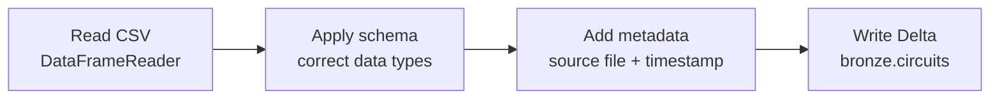

# Ingestion Requirements (Circuits)

We start building the bronze layer with the **circuits** dataset. The circuits file
sits in the landing layer under the `Files` volume and is a **CSV** file - raw text
separated by commas. Our goal is to load it into a Delta table called `circuits` in
the `bronze` schema.

!!! info "Why Delta?"
    Delta is the **default format** for managed tables in Databricks. It lets us
    interact with the data like a regular database table while providing reliability
    and transactional guarantees. (Covered in detail in the
    [Delta Lake](../09_delta-lake/01_delta-lake.md) section.)

## The ingestion pattern

| Step | What we do |
| --- | --- |
| **Read** | Read the CSV file from the landing layer. |
| **Schema** | Make sure data types are correct. |
| **Metadata** | Add source file name and ingestion timestamp. |
| **Write** | Write to the bronze layer as a Delta table. |

## A note on schema enforcement

In the industry, two approaches are both common for the bronze layer:

| Approach | Description |
| --- | --- |
| **Schema inference** | Let Spark infer the schema; don't enforce it. |
| **Explicit schema** | Define and enforce the schema from bronze onwards. |

!!! note "We'll learn both"
    This course demonstrates **schema inference first**, then defines and **enforces**
    an explicit schema for the project. Defining the schema upfront gives **predictable
    data types** and avoids future surprises - while still preserving the source
    structure (we won't alter it, just be explicit about it).

## Implementation in PySpark

We'll use the **DataFrameReader** API to read the file into a DataFrame, the
**DataFrame** API to add metadata (source file, ingestion timestamp), and the
**DataFrameWriter** API to write to the bronze table - building this pattern step by
step in the next lessons.

## What's next

First, read the data with the DataFrameReader. Continue to
[Reading Data: DataFrameReader](03_dataframe-reader.md).

## References

- [Spark CSV data source options](https://spark.apache.org/docs/latest/sql-data-sources-csv.html)
- [PySpark DataFrameReader](https://spark.apache.org/docs/latest/api/python/reference/pyspark.sql/api/pyspark.sql.DataFrameReader.html)
- [PySpark DataFrameWriter](https://spark.apache.org/docs/latest/api/python/reference/pyspark.sql/api/pyspark.sql.DataFrameWriter.html)
- [File metadata column](https://learn.microsoft.com/en-us/azure/databricks/ingestion/file-metadata-column)
- [What are tables in Azure Databricks?](https://learn.microsoft.com/en-us/azure/databricks/tables/table-overview)
