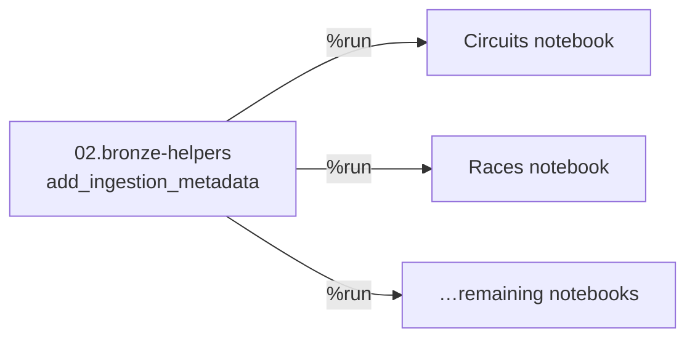

# Refactoring: Extracting Helper Functions

Both ingestion notebooks add the **same metadata columns** (source file and ingestion
timestamp), and the remaining four files will too. Instead of repeating this logic, we
extract it into a reusable **helper function**.

## Create the helper notebook

In the `00-common` folder, create `02.bronze-helpers` (Python):

```python
from pyspark.sql import functions as F

def add_ingestion_metadata(df):
    return (
        df
        .withColumn("ingestion_timestamp", F.current_timestamp())
        .withColumn("source_file", F.col("_metadata.file_path"))
    )
```

The function takes a DataFrame, adds the two metadata columns, and returns the new
DataFrame.

## Use it in the ingestion notebooks

`%run` the helper notebook to make the function available, then call it:

```python
%run ../00-common/02.bronze-helpers
```

```python
circuits_final_df = add_ingestion_metadata(circuits_df)
```

The metadata logic (and the `from pyspark.sql import functions as F` import) is now
**removed** from each ingestion notebook - it lives in the helper. Apply the same call
in the races notebook.



## Result

We've removed both **duplication** and **hard-coding** from the notebooks. This
improves readability, makes them easier to maintain, and makes them production-ready -
without changing any logic.

## What's next

With clean, reusable notebooks, we apply the pattern to the remaining datasets,
starting with constructors (JSON). Continue to
[Ingesting Constructors](10_constructors-file.md).

## References

- [Spark CSV data source options](https://spark.apache.org/docs/latest/sql-data-sources-csv.html)
- [PySpark DataFrameReader](https://spark.apache.org/docs/latest/api/python/reference/pyspark.sql/api/pyspark.sql.DataFrameReader.html)
- [PySpark DataFrameWriter](https://spark.apache.org/docs/latest/api/python/reference/pyspark.sql/api/pyspark.sql.DataFrameWriter.html)
- [File metadata column](https://learn.microsoft.com/en-us/azure/databricks/ingestion/file-metadata-column)
- [What are tables in Azure Databricks?](https://learn.microsoft.com/en-us/azure/databricks/tables/table-overview)
