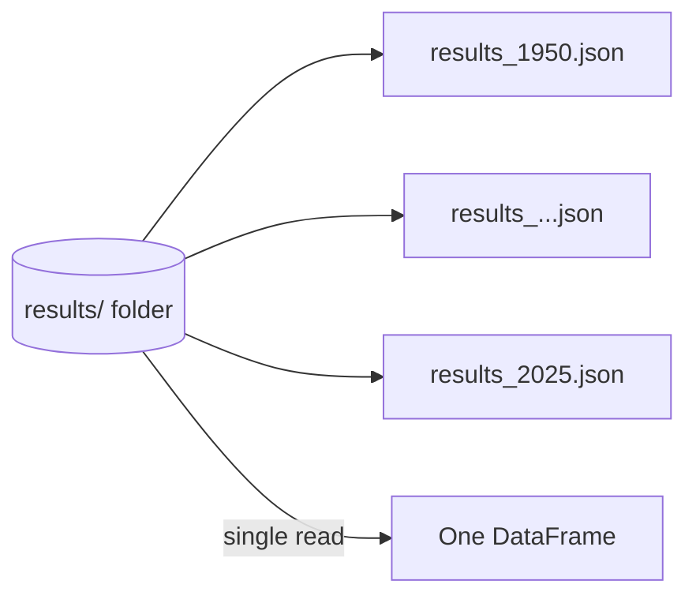

# Ingesting Results (Multiple Files)

The **results** dataset is single-line JSON, but unlike the previous datasets it's
**not one file** - it's stored inside a `results` folder containing **multiple files**,
one per season (e.g. `results_2024.json`).

!!! info "A common real-world pattern"
    Data often arrives **partitioned by time**, so you ingest all files from a
    directory rather than one named file.

## Reading a folder

Reading multiple files is simple in Spark: give the reader a **folder path** instead of
a file path, and Spark automatically lists and reads every file inside.



!!! tip "Assignment"
    The file structure (date, raceName, round, season, …) is ordinary single-line JSON
    you've handled before - the only new thing is the folder path. Try it yourself
    first; the solution follows.

## Solution

Set the source to the **folder**, not a file:

```python
%run ../00-common/01.environment-config
%run ../00-common/02.bronze-helpers

source_file = f"{landing_folder_path}/results"     # folder, not results.json
table_name  = f"{catalog_name}.{bronze_schema}.results"
```

Define the schema (e.g. `date` as DateType, `raceName` STRING, `round`/`season` INT,
…), then read the folder, add metadata, and write - identical to before:

```python
results_df = spark.read.format("json").schema(results_schema).load(source_file)

results_final_df = add_ingestion_metadata(results_df)

results_final_df.write.format("delta").mode("overwrite").saveAsTable(table_name)
```

Spark reads **all** files from the folder - over 10,000 records here.

## Verify all seasons loaded

```sql
%sql
SELECT season, COUNT(*) AS records
FROM formula1.bronze.results
GROUP BY season
ORDER BY season;
```

This confirms data from **1950 through 2025** was ingested in a single operation.

## What's next

The final dataset uses **multi-line** JSON: sprints. Continue to
[Ingesting Sprints](13_sprints-file-ingestion.md).

## References

- [Spark CSV data source options](https://spark.apache.org/docs/latest/sql-data-sources-csv.html)
- [PySpark DataFrameReader](https://spark.apache.org/docs/latest/api/python/reference/pyspark.sql/api/pyspark.sql.DataFrameReader.html)
- [PySpark DataFrameWriter](https://spark.apache.org/docs/latest/api/python/reference/pyspark.sql/api/pyspark.sql.DataFrameWriter.html)
- [File metadata column](https://learn.microsoft.com/en-us/azure/databricks/ingestion/file-metadata-column)
- [What are tables in Azure Databricks?](https://learn.microsoft.com/en-us/azure/databricks/tables/table-overview)
