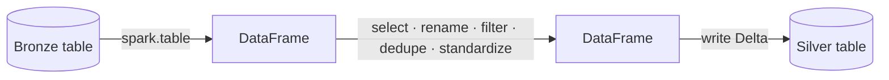

# Data Transformation (Silver) - Section Overview

In this section we transform the data ingested into the **bronze** layer and write the
results to the **silver** layer.

## Recap: silver layer requirements

- **Clean and standardize** the data for consistency across all datasets.
- Apply **consistent naming conventions** and reshape data where necessary
  (including **flattening nested structures**).
- **Remove unnecessary columns** and perform basic **data quality checks** (null key
  values, duplicate records).
- **Preserve business keys** (season, round, driverId, constructorId, …) so entity
  relationships are maintained.
- Prepare the data for **analytical and reporting** workloads in the gold layer.

## The approach with Spark

Spark's DataFrame APIs let us filter, rename columns, standardize values, and enforce
data-quality rules efficiently and at scale. The pattern is **read → transform →
write**:

We start by transforming the **circuits** dataset step by step - read from bronze,
select required columns, standardize column names, apply data quality checks, and
write. Then we apply the same approach to races, constructors, drivers, results, and
sprints.

By the end of this section, all datasets are transformed and stored in the silver
layer, ready for building the gold layer. Let's get started.

## References

- [PySpark DataFrame API](https://spark.apache.org/docs/latest/api/python/reference/pyspark.sql/dataframe.html)
- [PySpark SQL functions](https://spark.apache.org/docs/latest/api/python/reference/pyspark.sql/functions.html)
- [Lakeflow Jobs](https://learn.microsoft.com/en-us/azure/databricks/workflows/jobs/jobs)
- [Configure compute for jobs](https://learn.microsoft.com/en-us/azure/databricks/jobs/compute)
