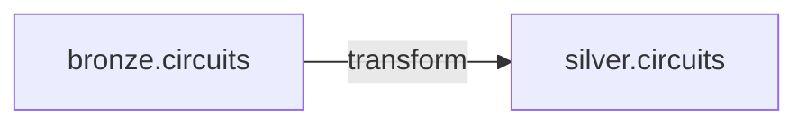

# Silver Requirements (Circuits)

We begin the silver layer with the **circuits** dataset. The data already exists in
the `bronze` schema as a Delta table - we're no longer working with raw files. We take
the bronze table, apply transformations, and write the silver `circuits` table (also
Delta).

## Transformation requirements

| # | Requirement |
| --- | --- |
| 1 | **Keep only analytics columns** - drop the `url` column. |
| 2 | **Standardize column names** to snake_case (e.g. `circuitId` → `circuit_id`). |
| 3 | **Make names meaningful** - e.g. `lat`/`lng` → `latitude`/`longitude`. |
| 4 | **Remove duplicates**. |
| 5 | **Filter null keys** - drop records where `circuit_id` (the business key) is null. |
| 6 | **Title-case** `circuit_name` and `locality` for readable downstream reports. |

!!! tip "Why snake_case?"
    Lowercase-with-underscores works well in **both PySpark and SQL**. It's the common
    Python convention, and since SQL in Databricks is **case-insensitive**, snake_case
    keeps column names simple and readable.

## The implementation pattern

The pattern is consistent with the bronze notebooks: **read → transform → write**.

| Stage | DataFrame API methods |
| --- | --- |
| **Read** | read the bronze Delta table into a DataFrame |
| **Transform** | `select` (columns), `filter` (rows), `dropDuplicates` (duplicates), etc. |
| **Write** | write the result as a silver Delta table |

## What's next

First, read the bronze table and select the required columns. Continue to
[Reading & Selecting Columns](03_read-table-select-columns.md).

## References

- [PySpark DataFrame API](https://spark.apache.org/docs/latest/api/python/reference/pyspark.sql/dataframe.html)
- [PySpark SQL functions](https://spark.apache.org/docs/latest/api/python/reference/pyspark.sql/functions.html)
- [Lakeflow Jobs](https://learn.microsoft.com/en-us/azure/databricks/workflows/jobs/jobs)
- [Configure compute for jobs](https://learn.microsoft.com/en-us/azure/databricks/jobs/compute)
