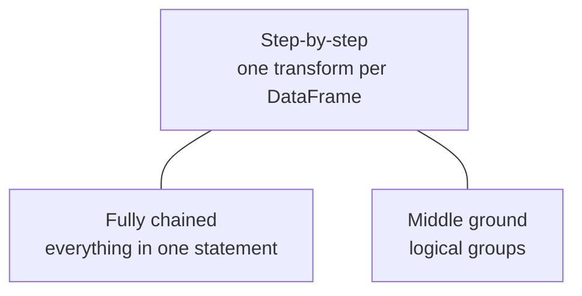

# Transforming Results

The **results** dataset is more complex - more columns and a **four-part composite
key** (`season`, `round`, `constructorId`, `driverId`). The bronze data contains both
**null business keys** and **duplicate records**, so key quality matters. The
transformation requirements are the same as before; this lesson uses results to
explore **Spark coding styles**.

## Requirements

Read → select columns → standardize names → **filter null keys** → remove duplicates →
title-case values → write.

## Three coding styles



### Step-by-step

Each transformation creates an intermediate DataFrame.

```python
results_df          = spark.table(bronze_table)
results_selected_df = results_df.select(...)           # drop url
results_renamed_df  = results_selected_df.withColumnsRenamed({...})
results_valid_df    = results_renamed_df.filter(
    F.col("season").isNotNull() & F.col("round").isNotNull() &
    F.col("constructorId").isNotNull() & F.col("driverId").isNotNull()
)
results_dedup_df    = results_valid_df.dropDuplicates(
    ["season", "round", "constructor_id", "driver_id"]
)
results_final_df    = results_dedup_df.withColumn("race_name", F.initcap(F.col("race_name")))
results_final_df.write.format("delta").mode("overwrite").saveAsTable(silver_table)
```

| Pros | Cons |
| --- | --- |
| Each step explicit; easy to debug | More intermediate variables |
| Easy to inspect with `display()` | Longer notebook |
| Maintainable, easy to review | |

### Fully chained

Everything in one statement.

```python
results_df = (
    spark.table(bronze_table)
    .select(...)
    .withColumnsRenamed({...})
    .filter(...)
    .dropDuplicates([...])
    .withColumn("race_name", F.initcap(F.col("race_name")))
)
```

| Pros | Cons |
| --- | --- |
| Concise, fewer variables | Hard to read as transforms grow |
| Feels elegant to experienced devs | Hard to debug a single big block; can't inspect intermediates |

### Middle ground (recommended)

Group **related** transformations into logical blocks:

```python
# Group 1: read + shape (select + rename)
results_df = (
    spark.table(bronze_table)
    .select(...)                       # drop url
    .withColumnsRenamed({...})
)

# Group 2: data quality (filter null keys + dedupe)
results_valid_df = (
    results_df
    .filter(
        F.col("season").isNotNull() & F.col("round").isNotNull() &
        F.col("constructor_id").isNotNull() & F.col("driver_id").isNotNull()
    )
    .dropDuplicates(["season", "round", "constructor_id", "driver_id"])
)

# Group 3: value transforms
results_final_df = results_valid_df.withColumn(
    "race_name", F.initcap(F.col("race_name"))
)

# Write
results_final_df.write.format("delta").mode("overwrite").saveAsTable(silver_table)
```

!!! tip "Recommended approach"
    The **middle ground** gives the best of both worlds - readable (grouped into
    logical stages) yet concise. It reflects real-world production pipelines where
    clarity and maintainability matter. This is what the course uses for results.
    (Here it removed ~108 records: ~97 null keys + ~11 duplicates.)

!!! info "Performance is the same"
    There's **no significant performance difference** between the styles. Spark builds
    a logical plan and **optimizes** all transformations before executing on an
    **action** (e.g. `display` or write) - it doesn't run line by line. So choose based
    on **readability, maintainability, and debugging**, not performance.

## What's next

The final dataset, sprints, has the same structure as results. Continue to
[Transforming Sprints](11_sprints-data.md).

## References

- [PySpark DataFrame API](https://spark.apache.org/docs/latest/api/python/reference/pyspark.sql/dataframe.html)
- [PySpark SQL functions](https://spark.apache.org/docs/latest/api/python/reference/pyspark.sql/functions.html)
- [Lakeflow Jobs](https://learn.microsoft.com/en-us/azure/databricks/workflows/jobs/jobs)
- [Configure compute for jobs](https://learn.microsoft.com/en-us/azure/databricks/jobs/compute)
