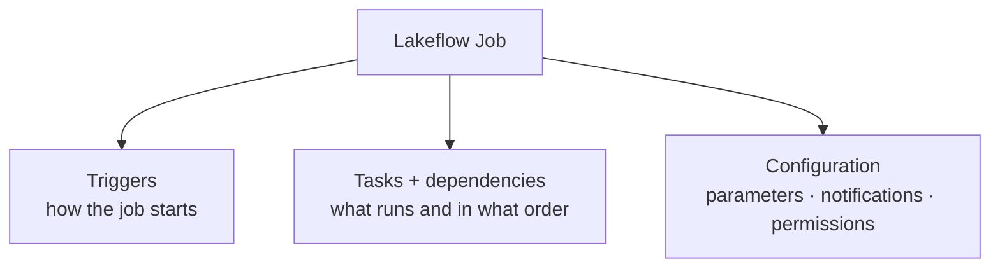
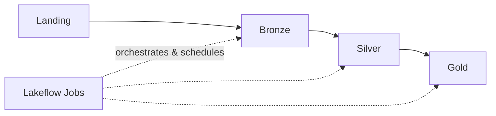

# Lakeflow Jobs - Introduction

We've built the landing, bronze, and silver layers as notebooks. Before moving to
gold, we need **orchestration** - in production these layers can't run as isolated
notebooks that we trigger manually.

## Why orchestration?

A production pipeline needs to:

- Run **automatically** (no manual execution).
- Enforce **ordering** - bronze must complete before silver begins; downstream layers
  run only if upstream succeeds.
- Make **failures visible** and allow controlled **reruns**.

This coordination turns a collection of notebooks into a production-grade data
platform - and that's what **Lakeflow Jobs** provide.

!!! info "A service with many names"
    Lakeflow Jobs has been renamed over the years - you'll see **Databricks
    Workflows** and **Databricks Jobs** in older docs. All three refer to the **same**
    orchestration service. Databricks now calls it **Lakeflow Jobs**.

## Architecture

Lakeflow Jobs is a **managed orchestration service**: you define the job, tasks,
dependencies, triggers, and notifications, while Databricks manages the job control
plane. Task compute is configured separately and can use serverless jobs compute,
classic jobs compute, all-purpose compute, SQL warehouses, or pipeline compute,
depending on the task type.

### Triggers

| Trigger | Description |
| --- | --- |
| **Manual** | Run on demand. |
| **Schedule (cron)** | Run on specific days/intervals. |
| **File event** | Run when a new file arrives. |
| **Table event** | Run on table updates. |
| **Continuous** | Next run starts as one completes. |

### Tasks & dependencies

Define tasks and the dependencies between them to orchestrate the workflow. Lakeflow
now supports complex multi-task workflows **without** third-party tools like Azure
Data Factory or Airflow.

### Configuration options

- **Parameterize** jobs for dynamic, reusable pipelines.
- **Notifications** (email, Microsoft Teams) on completion/failure.
- **Git** integration - run directly from repositories.
- **Role-based access control** for who can view/edit/manage jobs.

## Monitoring & reliability

The Jobs UI provides monitoring for real-time and historic runs - logs, execution
details, and performance metrics at both **job** and **task** level. On failure you
can rerun the whole job or just the failed tasks, and configure **automatic retries**
for transient issues (network, resource contention).

Lakeflow Jobs completes the lakehouse architecture by adding **orchestration and
scheduling** - bringing structure and reliability to the pipelines we've built.

## What's next

Next we create the Lakeflow Job for our project. Continue to
[Creating a Job](13_create-databricks-job.md).

## References

- [PySpark DataFrame API](https://spark.apache.org/docs/latest/api/python/reference/pyspark.sql/dataframe.html)
- [PySpark SQL functions](https://spark.apache.org/docs/latest/api/python/reference/pyspark.sql/functions.html)
- [Lakeflow Jobs](https://learn.microsoft.com/en-us/azure/databricks/workflows/jobs/jobs)
- [Configure compute for jobs](https://learn.microsoft.com/en-us/azure/databricks/jobs/compute)
