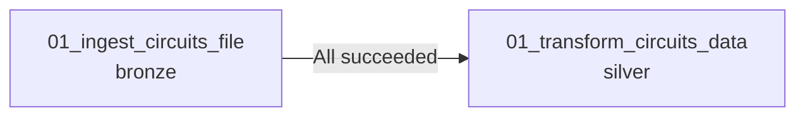

# Task Dependencies

This lesson adds a second task and creates a **dependency** between the bronze and
silver circuits notebooks, so silver runs only after bronze succeeds.

## Adding a dependent task

In the job, go to **Tasks**. We have one task (ingest circuits → bronze). Add another:

1. **Add task** → **Notebook**.
2. Databricks **auto-creates a dependency** on the previous task (visible in the
   **Depends on** property). You can remove it to run tasks in parallel.
3. Configure the new task:
   - **Name** - e.g. `01_transform_circuits_data`
   - **Type** - Notebook; select the **silver** notebook from the workspace
   - **Compute** - the **Job cluster** (recommended over all-purpose)
   - **Depends on** - select the bronze task

## The "Run if" condition

The **Depends on** property pairs with a **Run if dependencies** condition that
controls *when* the dependent task runs:

| Run if | Behaviour |
| --- | --- |
| **All succeeded** | Run only if all dependencies **succeeded** (our choice). |
| **All done** | Run regardless of success/failure. |
| **All failed** | Run only if dependencies failed - e.g. to send a custom failure notification. |

!!! tip "Failure-notification pattern"
    Instead of configuring notifications on every task, you can add a downstream task
    with **Run if = All failed** that sends a custom-formatted alert.

## Running the job

Click **Create task**, then **Run** → **View run**:

- The job acquires the **Job cluster** (takes a moment to start).
- The bronze task runs first; the silver task shows as **Blocked**, waiting for bronze
  to complete - confirming the dependency works.
- Both tasks succeed, with silver running only after bronze.

## Monitoring

Back in **Jobs & Pipelines → the job**, the run history shows each execution with
timings. (Running two tasks takes longer than one.)

## What's next

Next we run independent tasks **in parallel**. Continue to
[Parallel Execution](16_parallel-execution.md).

## References

- [PySpark DataFrame API](https://spark.apache.org/docs/latest/api/python/reference/pyspark.sql/dataframe.html)
- [PySpark SQL functions](https://spark.apache.org/docs/latest/api/python/reference/pyspark.sql/functions.html)
- [Lakeflow Jobs](https://learn.microsoft.com/en-us/azure/databricks/workflows/jobs/jobs)
- [Configure compute for jobs](https://learn.microsoft.com/en-us/azure/databricks/jobs/compute)
