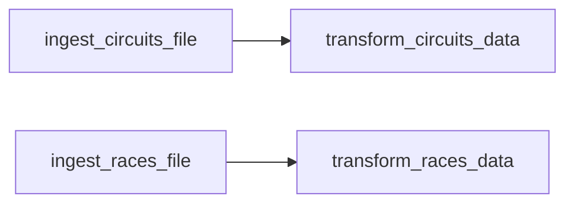

# Parallel Execution

Independent tasks can run **in parallel**. The races data comes from a different file
and writes to a different table than circuits, so the two bronze ingestions can run
alongside each other.

## Adding parallel tasks

In the job's **Tasks** view, add the races bronze task **without** a dependency on the
circuits task (remove the auto-added dependency). Then add the races silver task,
dependent on the races bronze task.

The two bronze tasks run **in parallel**; each silver task waits for its own bronze
task.

## One job cluster vs multiple

!!! tip "Reuse one job cluster (usually)"
    You can run multiple tasks on the **same** job cluster or create new ones. Prefer
    **one** job cluster per job - starting/stopping a cluster takes ~3–4 minutes, so
    once it's up, it picks up the next task immediately.

    For **high-volume parallel** workloads you may want **separate** clusters per
    parallel branch (**Add new job cluster**). Our data is small, so a single 16 GB
    job cluster is more than enough.

## Running the job

Click **Run now** → **View run**:

- While compute is acquired, both bronze tasks show **Pending**, and the two silver
  tasks show **Blocked** (waiting on their bronze tasks).
- Once the cluster is up, **both bronze tasks run in parallel**.
- Each silver task starts as soon as its bronze task completes; the job succeeds.

## What's next

Next we handle and recover from a **failed** job. Continue to
[Debugging a Failed Job](17_debug-failed-lakeflow-job.md).

## References

- [PySpark DataFrame API](https://spark.apache.org/docs/latest/api/python/reference/pyspark.sql/dataframe.html)
- [PySpark SQL functions](https://spark.apache.org/docs/latest/api/python/reference/pyspark.sql/functions.html)
- [Lakeflow Jobs](https://learn.microsoft.com/en-us/azure/databricks/workflows/jobs/jobs)
- [Configure compute for jobs](https://learn.microsoft.com/en-us/azure/databricks/jobs/compute)
