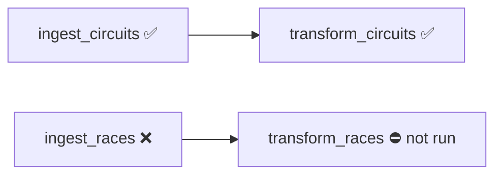

# Debugging a Failed Job

Failures are common in production. You should be able to **identify** the issue,
**fix** it, and **rerun** only the failed part. This lesson demonstrates that by
deliberately breaking the races ingestion notebook (commenting out the `source_file`
and `table_name` variables so the read fails).

## Identifying the failure

Run the job - it **fails**:

- `ingest_circuits_file` and `transform_circuits_data` **succeed**.
- `ingest_races_file` **fails**.
- `transform_races_data` **doesn't run** - it's waiting for the (failed) bronze task.

Click into the failed bronze task to see the error in the notebook output - e.g.
**`source_file is not defined`** (the variable we commented out).

## Fixing the issue

Open the notebook (the task view has a URL link that opens it in a new tab),
uncomment the variables, and save.

## Repairing the run

Rather than rerunning everything, **repair** only the failed tasks:

1. Go to the job → **Runs** → open the failed run → **Repair run**.
2. The tasks that will rerun are highlighted (a blue outline). By default, the failed
   `ingest_races_file` and its downstream `transform_races_data` are selected.
3. You can add/remove tasks - hovering a task lets you include all **upstream** or
   **downstream** tasks (handy for long pipelines). The already-succeeded circuits
   tasks are excluded.
4. Click **Repair run** - only the races bronze and silver tasks rerun; the job
   succeeds.

!!! tip "Why repair instead of full rerun?"
    Rerunning from the beginning adds **cost** and **delays** data availability.
    Repairing from the point of failure reruns only what's needed - Lakeflow lets you
    resume from where it failed.

## What's next

Finally, we add tasks for the remaining four datasets to complete the job. Continue to
[Completing the Job](18_complete-job.md).

## References

- [PySpark DataFrame API](https://spark.apache.org/docs/latest/api/python/reference/pyspark.sql/dataframe.html)
- [PySpark SQL functions](https://spark.apache.org/docs/latest/api/python/reference/pyspark.sql/functions.html)
- [Lakeflow Jobs](https://learn.microsoft.com/en-us/azure/databricks/workflows/jobs/jobs)
- [Configure compute for jobs](https://learn.microsoft.com/en-us/azure/databricks/jobs/compute)
