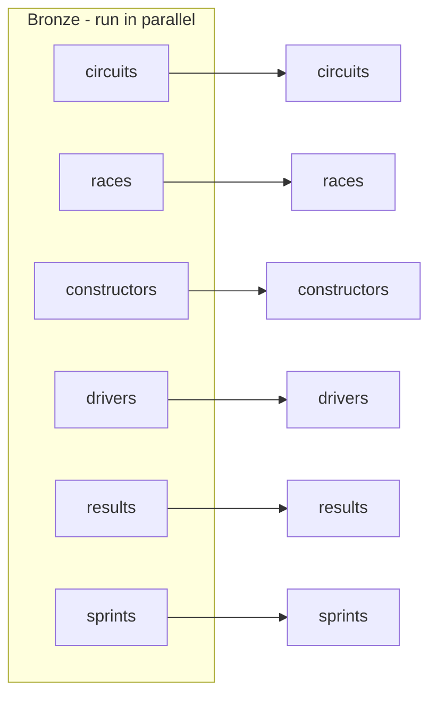

# Completing the Job

Finally, we add tasks for the remaining four datasets - **constructors, drivers,
results, sprints** - completing the full-refresh job.

## What to add

Each dataset needs a **bronze** ingestion task and a **silver** transformation task
(silver dependent on its bronze), giving **12 tasks** in total: 6 bronze + 6 silver.

!!! tip "Assignment"
    You've done this for circuits and races - add the other four pairs the same way
    (Notebook tasks on the job cluster, each silver task depending on its bronze
    task). The solution follows the identical pattern.

## Running the complete job

Click **Run now** to execute all **12 tasks**:

- All six **bronze** notebooks run **in parallel** once the cluster is up.
- Each **silver** notebook waits for its bronze task, then runs.
- All tasks succeed and the job succeeds.

## Section complete

We've built a complete Lakeflow Job that orchestrates all bronze and silver notebooks
- with task dependencies, parallel execution, failure recovery, and monitoring. The
pipeline now runs as a coordinated, production-grade workflow.

The lakehouse is ready for the **gold** layer.

## References

- [PySpark DataFrame API](https://spark.apache.org/docs/latest/api/python/reference/pyspark.sql/dataframe.html)
- [PySpark SQL functions](https://spark.apache.org/docs/latest/api/python/reference/pyspark.sql/functions.html)
- [Lakeflow Jobs](https://learn.microsoft.com/en-us/azure/databricks/workflows/jobs/jobs)
- [Configure compute for jobs](https://learn.microsoft.com/en-us/azure/databricks/jobs/compute)
